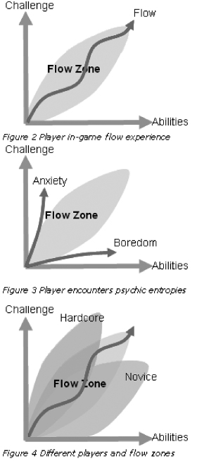
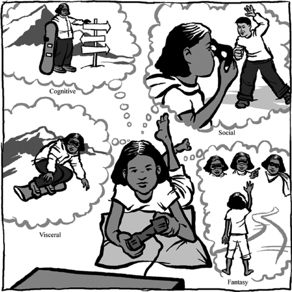
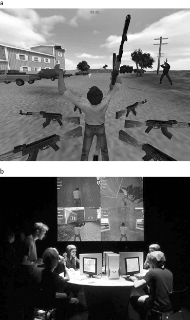
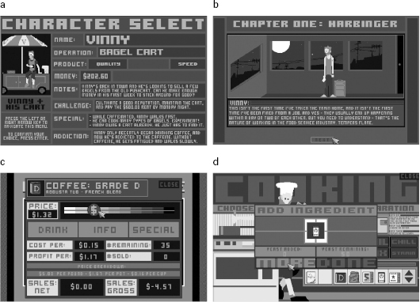
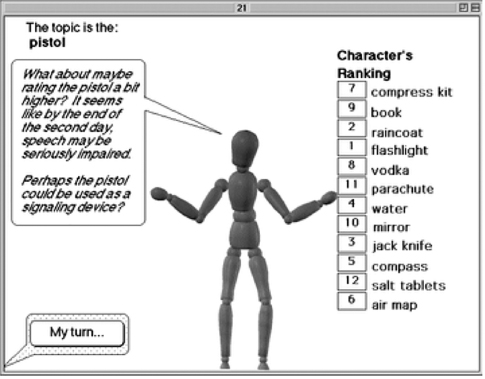
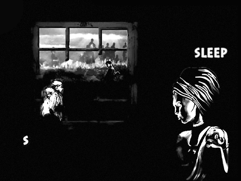
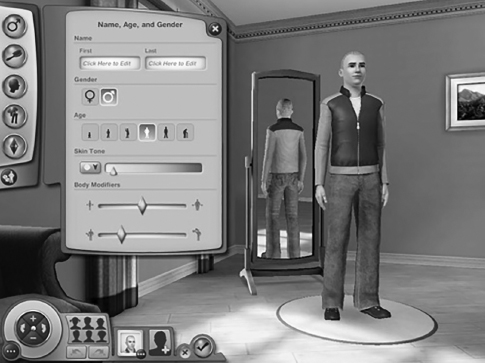
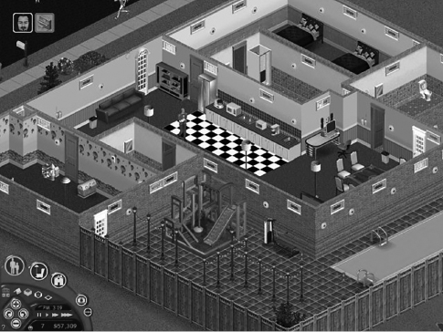
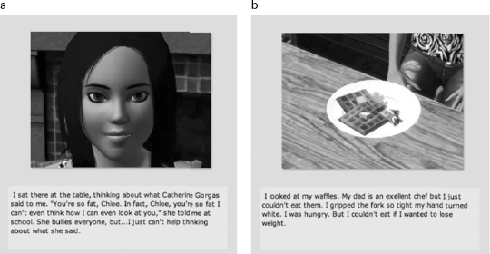

# 1 A Series of Interesting Choices: The Building Blocks of Emotional Design

# 1 A Series of Interesting Choices: The Building Blocks of Emotional Design

> People talk about how games don’t have the emotional impact of movies. I think they do—they just have a different palette. I never felt pride, or guilt, watching a movie.
>
> —Will Wright, designer of *The Sims*[1](#c1-note-1)

Compelling games don’t happen by accident, any more than do gripping novels, movies, or music. In all these media, creators draw from a well-defined set of strategies and techniques to create a specific emotional experience. Musicians, for instance, might use a minor key and slower tempo to create a sad or anxious mood (at least in the West). Film directors use close-ups to create intimacy. Game developers, too, have been honing techniques that lead players through intentionally designed emotional experience, whether that experience is the offbeat and comic mood of *The Sims* or *Angry Birds*, or the dramatic intensity of *Call of Duty*. Unlike film, fiction, or music, there isn’t yet a common language among designers, players, and society at large for what is going on and why in the hearts and minds of players. This chapter introduces building block concepts taken from game design and game research, which I believe offer insight into and provide a shared language for how, exactly, games move us. Specifically, two unique qualities, choice and flow, set games apart from other media in terms of potential for emotional impact. Layering techniques for evoking social emotions onto this foundation gives games their unique power to create empathy and connection. This chapter introduces three design innovations—avatars, nonplayer characters, and character customization—that are primary drivers for social emotions in players.

## Meaningful Choices

At their heart, games differ from other media in one fundamental way: they offer players the chance to influence outcomes through their own efforts.[2](#c1-note-2) With rare exception, this is not true of film, novels, or television. Readers and viewers of these other media follow along, reacting to the story and its twists and turns, without having a direct personal impact on the events they witness. In games, players have the unique ability to control what unfolds. As Sid Meier, designer of the best-selling game *Civilization*, once said, “a [good] game is a series of interesting choices.”[3](#c1-note-3)

Actions with consequences—interesting choices—unlock a new set of emotional possibilities for game designers. Ultimately, these possibilities exist because our feelings in everyday life, as well as games, are integrally tied to our goals, our decisions, and their consequences.[4](#c1-note-4) People go through a rapid and automatic set of evaluations as things happen to them, about what each event might mean for their goals and plans. Emotions arise in the context of these appraisals, and help guide quick and appropriate actions. Psychology researchers focused on this appraisal process, in fact, have used videogames as research instruments, in order to tightly control situations and demonstrate how particular challenges lead to emotional responses. For example, adding events that match up to someone’s in-game goals reliably induces more pride and joy in players, while adding events that block their goals leads to anger.[5](#c1-note-5)

Researchers can actually observe the traces of meaningful choices in the brain activity of gamers. Neuropsychology researchers created an experiment in which some participants played a game and others watched a live video stream of another person playing (essentially like watching a movie). The researchers used fMRI equipment to get a glimpse of everyone’s brain activity. The active gamers showed more activation of “reward-related mesolimbic neural circuits”—parts of the brain associated with motivation and reward[6](#c1-note-6)—than those who watched passively. Interacting with the game shifted the emotional patterns observed in the players’ brains, demonstrating how we human beings experience particular rewards and emotions from the act of playing.

To the human brain, playing a game is more like actually running a race than watching a film or reading a short story about a race. When I run, I make a series of choices about actions I will take that might affect whether I win. I feel a sense of mastery or failure depending on whether I successfully execute the actions in the ways I intended. My emotions ebb and flow as I make these choices and see what happens as a result. I feel a sense of consequence and responsibility for my choices. In the end, I am to blame for the outcomes, because they arise from my own actions. This rich set of feelings that I have about the solo experience of running depends on the active role that I play in the experience—that is, on my own meaningful choices. In the chapters ahead, we’ll explore how game designers build upon the feelings generated by choice and control to create a broad palette of emotional experiences for players.

## Flow

The ability to choose and control your actions gives rise to the second unique quality of games: the ease with which players can enter a pleasurable, optimal performance state that psychology researcher Mihaly Csikzentmihalyi calls “flow.” When people are in flow—when musicians play at their best, when athletes are in “the zone,” when programmers stay up all night creating brilliant code—time seems to melt away and personal problems disappear. Well-designed games, with the control they offer users over actions in a novel world, readily engage players in a flow state.

When Csikzentmihalyi and his colleagues studied people in flow, they isolated eight factors defining this optimal state—factors that will sound familiar to anyone who finds games compelling.

* a challenging activity requiring skill
* a merging of action and awareness
* clear goals
* direct, immediate feedback
* concentration on the task at hand
* a sense of control
* a loss of self-consciousness
* an altered sense of time

The role of the flow state in games was not lost on Csikzentmihalyi. In his book *Finding Flow*, he calls out games, “developed over the centuries for the express purpose of enriching life with enjoyable experiences,”[7](#c1-note-7) as excellent producers of flow in human beings.

Game designers such as Jenova Chen, who did his master’s thesis work on flow,[8](#c1-note-8) have found flow theory useful in exploring the deeper “why” behind the fun players have with games. Chen intentionally tried to reproduce the eight major factors of flow in his game design practice. By doing so, he developed some famously engaging games including *Journey* (discussed in chapter 4). Chen believes flow theory provides a working model for game designers, encouraging them to keep players in a sweet spot where they have the right amount of ability to meet the challenges at hand. Too little ability can result in anxiety and frustration; too little challenge can result in boredom or apathy (see [figure 1.1](#fig_001)).

[Figure 1.1](#fig_001a) Jenova Chen’s diagram of the “flow zone.”

*Source:* Jenova Chen, “Flow in Games,” MFA thesis, University of Southern California, 2006, <http://www.jenovachen.com/flowingames/Flow_in_games_final.pdf>

Increasingly, game designers aim to offer players interesting choices that fall within that sweet spot, generating flow. Flow theory has been a boon to the game design and research communities, moving discussion of what players feel and why away from the vague, if positive, notion of “fun” and into more nuanced emotional territory that can be shaped through design choices. When players discuss the emotions they feel when playing games,[9](#c1-note-9) much of their vocabulary relates to flow (curiosity, excitement, challenge, elation, or triumph) or the lack thereof (frustration, confusion, discouragement). Thus, flow theory offers a useful lens for understanding the unique emotional power of games compared to other media.

## Social Emotions

When designers offer interesting choices and keep players in flow, they’re able to also start evoking another class of feelings in their players—the rich social emotions we experience in relationship with others. In the 1980s, then fledgling game company Electronic Arts (EA) released an employee recruitment advertisement that asked “Can a Computer Make You Cry?”[10](#c1-note-10) This phrase became a rallying cry for those in the game industry interested in creating social feelings in players such as affection, camaraderie, empathy, or even grief and sadness.[11](#c1-note-11)

This was not an unreasonable question for EA to ask, given what was known about other media. Film and novels, for example, can evoke powerful social emotional responses. People read or watch or listen, start to feel immersed in the situation being presented/described, and then feel as if they were there. They begin to care about the characters and situations as if they were real. It is not uncommon, or shameful, to cry over something happening in a film or a book.

It’s also true that over time, some viewers/readers form powerful attachments to characters, a phenomenon known as “para-social interaction.”[12](#c1-note-12) Media creators encourage these strong feelings of connection and cultivate them through strategic design elements. For example, TV hosts may make conversational asides to viewers to generate a feeling of intimacy and familiarity. Likewise, film directors often shoot at close range to create the illusion of intimate distance between the character and the viewer. Such techniques amplify identification with the virtual people and situations.

Experts in an area of psychology called “grounded cognition” argue that these techniques evoke emotion because they mirror the way our brains make sense of the world around us in everyday life. They posit that our brains compare what we sense and experience in any given moment to our past experiences (whether “real” or “mediated”—that is, created by media) in order to come up with a set of emotional and cognitive responses that are “grounded” in experience.[13](#c1-note-13) So if we see or hear (or form a mental picture of) a person experiencing feelings in a social setting that we, too, are immersed in, our brains are “tricked” into believing that a real social experience is taking place. Of course we engage this delusion willingly—it allows us to experience alternate situations and ways of being human, which in turn informs our own experience of being human.

This tradition, as old as oral storytelling, still provides an effective way to share emotional and social wisdom and experience. Yet in any medium other than games, we are only witnesses, not actors, and cannot affect the outcomes of the stories before us.

Grounded cognition theory helps explain what it is about games that changes the range of emotional experiences possible for players when they take on an alternate identity or social situation during play. Consider this example that led to the chapter’s epigraph from Will Wright, designer of the best-selling PC game franchise of all time, *The Sims*. Wright describes the first time he played *Black and White: Creature Isle*.[14](#c1-note-14) In this game, the player has a creature that he trains, who acts as his go-between with the villagers in the game world. The player can mold an evil creature by treating it badly, or create a moral creature by treating it kindly. Curious about the outcome of ill treatment, Wright began to slap his creature—then was astonished to find himself feeling guilty about it, even though this was very obviously not a real being with real emotions. This capacity to evoke actual feelings of guilt from a fictional experience is unique to games. A reader or filmgoer may feel many emotions when presented with horrific fictional acts on the page or screen, but responsibility and guilt are generally not among them. At most, they may feel a sense of uneasy collusion. Conversely, a film viewer might feel joyful when the protagonist wins, but is not likely to feel a sense of personal responsibility and pride. Because they depend on active player choice, games have an additional palette of social emotions at their disposal.

Brenda Brathwaite Romero’s *Train* (see [figure 1.2](#fig_002)) offers an elegant example of a game that calls on interesting choices and the flow state to implicate players in social choices and outcomes. Winner of the Vanguard Award at IndieCade (the primary venue for showcasing independent games in the United States), this tabletop board game is part of Romero’s Mechanics Is the Message series. (A game *mechanic* is an action that a player can take that changes the game state.[15](#c1-note-15)) She created these games specifically to evoke a feeling difficult to achieve in other media—complicity.[16](#c1-note-16) Players of *Train* move boxcars full of passengers from one place to another, dealing with obstacles and challenges along the way. Only at the end of the game do they learn the train’s destination: Auschwitz. Some players realize what’s happening midgame and turn their attention to saving as many passengers as they can. Almost all players feel strong emotions after they have experienced the endgame, whether or not they realized what was going on in the midst of play. Romero says: “Ultimately, I think the power of a game lies in its ability to bring us close to the subject. There is no other medium that has this power. I saw people cry over *Train*, not just once, but multiple times. People watching, playing, those trying to save the passengers. That’s powerful, and it’s the medium that does that.”[17](#c1-note-17)

[Figure 1.2](#fig_002a) Brenda Brathwaite Romero’s *Train*.

*Source:* *Train* (exhibited only, 2009); photo courtesy of Brenda Romero

In *Train*, Romero creates a tension by juxtaposing the satisfying, flow-style emotions the player feels while mastering the system and rules of the game with the negative emotions that arise from the social context of these actions. In this regard, *Train* can be seen as a meditation on similar painful and horrific emotional juxtapositions that may have occurred in the actual historical situation.

Romero’s other board games in the Mechanics Is the Message series are equally stark and simple, encouraging a focus on the systems and rules of games that works to forge complicity. They bring home the power of games, whether digital or not, to evoke deep, socially based emotions triggered by choice and consequence.

## Avatars—Inhabitable Protagonists

Since the days of ancient Greek theater[18](#c1-note-18) and probably far earlier, storytellers have created specific characters with whom viewers or readers could identify, whose eyes provided the primary point of view—protagonists. Game designers have adopted and adapted this technique for grounding a player’s identification with in-game events. In gaming, the protagonist is known as “the player character” or “avatar.” As with protagonists in film, the player learns about avatars through how they look and how they react to other characters (in games, there can be software-driven nonplayer characters that a player meets and interacts with as if they are real other people in the game’s story world). However, the avatar’s personal qualities and capacities are also reflected in what it is possible for the player to *do* on multiple psychological levels (see [figure 1.3](#fig_003)). The player moves through the game world taking actions as this person, adopting his or her concerns and struggling toward his or her goals. Players controlling avatars project themselves into the character on four levels: visceral, cognitive, social, and fantasy. The player’s prosthetic body, with its specific capabilities and tendencies, becomes a vehicle for action. The player builds skill and strength over time, which is reflected in this virtual body in the game world (this is the “visceral level” of character experience). Certain strategies, actions, and reactions are rewarded over others, through designer choices about game mechanics and outcomes (this is the “cognitive level” of experience). Inhabiting the avatar’s social persona allows the player to try out social qualities they may not normally possess (providing a “social level” of experience). All of these design choices work together to allow the player to explore alternate fantasy selves through actual in-game performance (providing a “fantasy level” of experience). Over the course of gameplay, players extend themselves further into the motivations and the visceral, cognitive, social, and fantasy possibilities of the avatar, forging an identification grounded in observation as well as action and experience.[19](#c1-note-19)

[Figure 1.3](#fig_003a) Players project themselves more deeply onto game avatars than protagonists in other media because avatars offer action possibilities at multiple psychological levels.

*Source:* Katherine Isbister, *Better Game Characters by Design: A Psychological Approach* (Boca Raton, FL: CRC/Morgan Kaufmann, 2006); image courtesy of CRC Press, Taylor & Francis Group

Consider, for example, a snowboarding game. The player viscerally feels like the snowboarding avatar. Through her controller, she may have a physical sensation of bouncing along on virtual snow. She hears the sounds of her board sliding, the thwack of the board landing after she makes a jump. If the game is in the third-person perspective (where you see your avatar move through the action, as if through a camera hovering above and behind), then the player also sees the avatar make that perfect landing or stutter a bit and recover. On a cognitive level of identification, the player thinks through her choices, deciding which runs to go down and which moves to make, given the strengths and possibilities of her avatar. She can ham it up for the virtual crowd in the game as if she is the snowboarder (social identification). All of this allows her to enjoy performing and experiencing the fantasy identity of a champion snowboarder, winning races and conquering mountains.

This joining of player to virtual self through avatar-based action marks a core innovation that games have brought to media, and an extremely powerful one for evoking emotion. Let’s look at an example that does some of the same emotional work as *Train*, but in a digital setting, with the added power of a player avatar.

*Waco Resurrection* is a fascinating and disturbing game that takes as its subject the 1993 Waco siege, in which the government sent agents into the Branch Davidian cult/religious group’s compound in Texas. The game’s designers at c-level, a Los Angeles-based artist workspace and collective, developed the game specifically for art gallery–style settings. Inhabiting an avatar of cult leader David Koresh, the player must defend the Branch Davidian compound against government agents. The game engine (a software framework) used to generate *Waco Resurrection* was originally designed for producing “shooter” games. Thus the look and feel of the game, and the types of player actions it supports, resemble other shooter-style games that players might have encountered in the past. Players can engage in typical shooter mechanics, like firing weapons and killing other characters while moving through indoor and outdoor terrain. The player also has to navigate around other Branch Davidian members in the compound.

The audio soundscape enhances the player’s visceral immersion in the experience: at different points, the player hears FBI negotiators, battle sounds, even the voice of God. The artists included audio recordings that FBI agents played to disorient the actual compound members when they launched their assault (i.e., the sounds of drills, screaming animals, etc.).

*Waco Resurrection* uses a “third-person” perspective for the avatar (see [figure 1.4a](#fig_004)). Many shooter avatars are portrayed in a “first-person” view, which means the player moves through the game seeing everything as if through that avatar’s eyes, including seeing the avatar’s hands carrying and shooting weapons as if they are in the player’s peripheral vision. There is ongoing debate in the game design community as to whether and when to use a first- versus third-person view for the avatar in a game. Some players report that a first-person perspective helps them immerse themselves completely in their alternate identity; some observers feel first-person shooter games are more likely to incite real violence.[20](#c1-note-20) In *Waco Resurrection*, the third-person perspective helps continually remind players who they are supposed to be in the game.

[Figure 1.4a, b](#fig_004a) In *Waco Resurrection*, the player inhabits the role of cult leader David Koresh. In gallery installations of the game, players wore David Koresh helmet-masks that had embedded speakers and microphones (Eddo Stern, *Waco Resurrection 2003–2004*, web video, 2:49, <http://www.eddostern.com/video/wacobroadbandlow.mov>).

*Source:* *Waco Resurrectio*n (c-level, 2004); image courtesy of Eddo Stern

The game’s designers heighten the connection between player and avatar by requiring players to wear custom helmets designed for the experience (see [figure 1.4b](#fig_004)). On the outside, these look like a low-polygon (less rich and precise) version of David Koresh’s head and face. In a gallery setting, these helmets also serve the purpose of cutting off spectators from the actual identity of the player, whose head disappears into a creepy blurred version of Koresh. A microphone inside the helmet allows the player to speak key phrases aloud to use special powers in the game. For example, saying “wrath of god” brings a rainfall of flaming bibles down from the sky, killing everyone around the player. Saying “gun show” brings up a circle of AK-47s around the player that can be used to fire at everything around him. The spoken commands bring the player into an even more direct and intimate connection with the avatar’s choices and (imagined) mindset.

Eddo Stern, one of the creators, had this to say about the power of the game:

> One of the differences in making a game about an historical event is the nature of identification and implication. Games require the users to act and as such appear to implicate the player in the actions of the avatar they are controlling. This is rather obvious but does create new emotional experiences. Imagine a documentary about Hitler vs. a fictional film with an actor playing as Hitler vs. a game where the player plays as Hitler. The most common criticisms we heard about *Waco* were that the game is in bad taste, that the game is exploitative, that the game was pro Davidian/pro Koresh. The bad taste and exploitation criticism stem from people struggling to consider that games can be made about serious issues while still providing some ambiguity. The second criticism of the game being politically skewed assumes that Koresh as a protagonist = a Hero in the game—a unique issue that games reveal as a film about Hitler would likely not draw this criticism or a film about David Koresh.[21](#c1-note-21)

Inhabiting the persona of the cult figurehead at the heart of the episode is a unique way to experience the “extreme psycho-social phenomenon” of the historical event. The game’s designers see Koresh as “a paradoxical embodiment of the current [2004] political landscape—he is both the besieged religious other and the logical extension of the neo-conservative millennial vision.” They see *Waco* as a “primal scene of American fear: the apocalyptic visionary—an American tradition stretching back to Jonathan Edwards—confronts the heathen ‘other.’”[22](#c1-note-22)

*Waco Resurrection* received an honorary mention at Ars Electronica, one of the most prestigious venues for media art. The artists broke ground in exploiting digital games’ capacity to evoke agency and blur identity, producing a work that transcends simple stereotypes and that leaves the player uneasy, with a rich and unresolved emotional response. *Waco* exposes the potential of games to reopen problematic cultural episodes or issues for visceral reexploration, toward deeper understand­ing and continuing conversation. The game makes powerful use of the avatar to put the player (and spectators) into dia­logue with the work and with the historical events it seeks to portray.

Through an original and potentially disturbing use of avatars, *Waco Resurrection* brings players into the mind of an infamous renegade; at the opposite end of the spectrum, *Cart Life* gets players to inhabit the emotional headspace of more mundane everyday urban types who might otherwise go completely unnoticed. Designed as a “retail simulator for windows,” according to developer Richard Hofmeier,[23](#c1-note-23) the game swept three of the Independent Games Festival awards at the 2013 Game Developers Conference in San Francisco, including the Excellence in Narrative award. As one game journalist describes it:

> A young mom trying to provide for her daughter. A Ukrainian immigrant hoping to make a new life. A well-traveled bagel chef who can’t bring himself to walk away from the white-knuckle intensity of the food service industry. The heroes of *Cart Life* are anything but your typical video game protagonists. They are ordinary people, doing their best to get by in a world that doesn’t make it easy. By putting you in the shoes of these three individuals and letting you share in their struggles, *Cart Life* becomes a moving ode to the trials and tribulations of regular people who work themselves to the bone day in and day out just to get by.[24](#c1-note-24)

The player chooses one of three cart vendors to play, and then must engage in the work of running the cart, by commuting to and from work, managing inventory, chatting with customers, and the like (see [figure 1.5a–d](#fig_005)). Each of the vendors must also navigate personal challenges. For example, Melanie, who runs a coffee cart, needs money to help in her custody struggles and has to pick up her daughter, Laura, every day from school. The player, who gets to know Laura through walks and at home, works to balance Melanie’s goals through her everyday decisions.

[Figure 1.5a–d](#fig_005a) *Cart Life*: (a) overview, (b) introduction of Vinny (one of three player character choices), (c) buying supplies, and (d) preparing bagels.

*Source:* *Cart Life* (freeware, 2011); image courtesy of Richard Hofmeier

Hofmeier emphasizes his attempt at generating a realistic experience: “I wanted to make as realistic a game as I could. Sometimes I hear about how the larger game-playing audience is maturing, but I don’t buy it. I wanted a game like this when I was a kid—I wanted to learn how to live.” He interviewed street vendors about their lives to make sure he got the details right.[25](#c1-note-25) Notably he did not go after this emotional realism with high-resolution graphics—the art style of the game is grayscale and pixelated, and the music has a “chip tunes” aesthetic (a tinny, synthesized sound, like music from older game consoles that lacked sophisticated stereo output).

*Cart Life* masterfully evokes in players the feeling that there is never enough time, while also providing sweet moments with the customers and relatives and friends in the vendors’ everyday lives. Unlike many mainstream commercial games that cast the player in a heroic, larger-than-life persona, *Cart Life* puts the player deeply into an ordinary-scale human life, and still succeeds in creating feelings of struggle and triumph and connection. The aesthetic techniques and human subject matter of *Cart Life* help illuminate the broader emotional terrain that today’s independent games offer to players, in part through the use of astute avatar and nonplayer character choices.

## Nonplayer Characters—“Living, Breathing” Others in the Game World

Solitary gameplay is not by definition lonely. In fact, digital games frequently include virtual “living, breathing” others who provide support, resistance, and local color. Game designers use dynamic and reactive engagement with these other characters who populate a game’s story world to add to the emotional palette of games as a medium. In a film, the viewer learns about the protagonist through his or her interactions with other people in the narrative world of the film. In a game, players can themselves interact with those others—spending hours journeying alongside them, struggling to rescue them, sometimes experiencing betrayal by them and losing hard-won ground as a result. In a game, a nonplayer character can make a joke that lightens the mood during a slog, provide assistance in the nick of time, even sacrifice himself so that the player can carry on and win the day. This dynamic engagement with a virtual other lies at the root of feelings such as Wright’s guilt for slapping his creature. Interactions with NPCs move players beyond “para-social” feelings into consequential social experiences with accompanying social emotions and behaviors.

My own dissertation research at Stanford University helps demonstrate the power of interactive engagement with NPCs.[26](#c1-note-26) I was investigating whether an NPC’s dominant or submissive style “personality” would affect how persuasive that NPC was in a team situation. Participants in my research worked on a task called the desert survival problem. They were told to imagine that they had crashed in the desert in a small plane. When they came to, items from the plane were scattered around them—things like a compress kit, a book, a raincoat. They had to rank the items in order of survival importance. Then, each person had a “conversation” with a very simple NPC that would try to convince them to change their rankings of a few items (see [figure 1.6](#fig_006)).

[Figure 1.6](#fig_006a) The NPC in my dissertation research making suggestions about changing rankings of items in the desert survival task.

*Source:* Katherine Isbister, “Reading Personality in Onscreen Interactive Characters: An Examination of Social Psychological Principles of Consistency, Personality Match, and Situational Attribution Applied to Interaction with Characters,” Ph.D. dissertation, Stanford University, 1998

The NPCs showed signs of submissiveness or dominance in their body postures and in the way they phrased their advice. For example, in figure 1.6, the NPC has taken a dominant stance (arms wide) but is using hesitant, submissive-style language (“what about maybe” and “perhaps”). In the study, each person saw one of four versions of the NPC—consistent dominant cues, consistent submissive cues, or mixed (dominant body with submissive phrasing, or submissive body with dominant phrasing). As would be the case with real human beings, those who interacted with the mixed-signals NPCs were less influenced. They made fewer changes to their own ranking of the items than participants in the study who saw consistent NPCs. In real life, consistency in nonverbal cues is associated with honesty and trustworthiness. It is amazing that these sorts of responses hold true for engaging with virtual humans as well.[27](#c1-note-27) To the extent that NPCs display humanlike actions and reactions, we engage them using social norms and intuitive emotional responses. This means that game designers can create powerful feelings in players when they make use of relationships that players form with NPCs.

In 2008, a student (Corey Nolan) and I surveyed a range of players on what moments in games had actually made them cry (in a sort of answer to EA’s advertisement). The most frequently cited moments involved the death of NPCs with whom players had spent considerable time during gameplay. Players wept over losing valued and trustworthy companions.[28](#c1-note-28) The number one example from our survey was from 1983—an entirely text-based, interactive fiction adventure game named *Planetfall*. In this game, the player spends a lot of time with an NPC robot named Floyd. As *Creative Computing* magazine put it in a review of the game, “the most imaginative and cleverly written part of the entire game, Floyd, besides being hysterically funny through most of the adventure, evokes in the player of *Planetfall* authentic feelings of affection and attachment.”[29](#c1-note-29) In her famous academic treatise on games, *Hamlet on the Holodeck*, Janet Murray points out: “The memory of Floyd the Robot’s noble self-sacrifice remains with players even years later as something directly experienced. ‘He sacrificed himself for me,’ is the way one twenty-year-old former player described it to me.”[30](#c1-note-30)

Accomplished game designers use a range of subtle social cues from NPCs to produce feelings in players, putting NPCs into powerful and consequent social relationships with the player/avatar. In the game *Hush*, for example, game designers Jamie Antonisse and Devon Johnson made use of one of the most powerful human relationships—mother and child—and one of the most emotionally irresistible sounds—a baby crying—to create a simple, vignette-style game that is powerfully evocative (see [figure 1.7](#fig_007)). Created for a course the designers took while completing an MFA program at USC, Hush has the player control a Rwandan Tutsi mother, Liliane. She must “sing” a lullaby to her child to keep the child quiet, or risk the attention of Hutu soldiers who may kill them both. The player must press a letter key as that letter appears on-screen. The letters slowly appear, brighten, then fade. Hitting the key at just the right moment keeps things quiet. If the player fails too many times, the baby’s crying increases in intensity, the player sees silhouettes of soldiers, and the encounter ends with the mother’s gasp, gunfire, and the screen fading to red, indicating that the mother and child have been discovered. Despite (or perhaps because of) the spare, simple artwork, the player becomes caught up in the responsibility of taking care of the child, and filled with dread about what may happen if he does not succeed.

[Figure 1.7](#fig_007a) In *Hush*, the player must soothe a baby to keep it quiet and safe from soldiers outside.

*Source:* *Hush* (freeware, 2008); image courtesy of Jamie Antonisse and Devon Johnson

Playing the game and caring for the virtual child create a form of participation and involvement, and dramatically personalize the struggles of Rwandans. Choosing a universally understood, archetypal role (mother) for the player, an NPC that the player is physiologically hardwired to react to (baby), and a familiar activity (singing a lullaby) all contribute to the ease of immersion and identification that the game provides. To play it is to become, during gameplay, emotionally involved in the personal fears and consequences of this conflict. It is what Bogost, Ferrari, and Schweizer[31](#c1-note-31) would term an “editorial game”—a game designed to persuade the player in some way (in this case, to activate the player to notice and care about the human costs of a real-world struggle happening far away). Advocates of “games for change”—games designed to impact a player’s actions and growth toward advancing some kind of social good—believe this sort of immersion by enactment and identification may be an important tool in reaching younger audiences who are turning less and less to traditional information sources such as television and print journalism.

The game *Love Plus* uses NPCs to create another emotionally charged social interaction—courtship. In dating sims like *Love Plus* (a genre popular in Japan, though less popular in the United States so far), the player works to woo over an NPC (usually female) so that she and the player are “dating.” The end result might be a light romance, true love, or maybe even sim sex, depending upon the game subgenre (variations on dating games range from chaste to pornographic). Players try to improve their in-game personal qualities in order to attract their chosen one; meanwhile, they must choose the right things to say and do to court her and keep her love once she has admitted that she cares. Some dating sims are tethered to real time; many offer ways around this with the ability to preschedule actions and playing times. Some explore alternate input strategies such as voice and touch screens.

At the start of *Love Plus*, which is set in a high school, you can choose one of three girls to pursue: Nene, Manaka, and Rinko ([figure 1.8](#fig_008)). You meet Nene, a sort of older sister type, at your part-time job at a restaurant and Manaka, a wealthy, sporty girl a year ahead of you in school, at a tennis club. Rinko, your third option, is younger and shier than the other two, and is a bit standoffish when you meet on a library committee. (As a player, you don’t have a preset name: you’re referred to in the first person, but you can add nicknames the girls might use once they feel closer to you.)

[Figure 1.8](#fig_008a) *Love Plus*, a Japanese dating sim released on the Nintendo DS platform, has three female characters with whom the player can attempt to forge a relationship.

*Source:* *Love Plus 3DS* (Otaku Gaming/Konami, 2009)

The game has two phases. In the first, you decide which of these three girls to pursue, and set about courting her ([figure 1.9a, b](#fig_009) and [1.9c](#fig_010)). In the second, once you’ve won her over, you try to maintain a good relationship. During the courting phase, you have a hundred days to win her over; each day, you can choose four actions. Some build your personal characteristics (health, knowledge, sensibility, and charm), and some create openings for you to interact with the three girls. Over the course of your courtship, you receive progressively richer methods of communication with the object of your affections—for example, she shares her mobile number so you can text, and she’ll walk to and from school with you. As one reviewer describes it:

[Figure 1.9a, b](#fig_009a) The courting phase of *Love Plus*, in which the player chooses daily actions toward successfully wooing a particular girl.

*Source:* *Love Plus 3DS* (Otaku Gaming/Konami, 2009); bluemist, “Love Plus: Impressions,” *bluemist*, September 5, 2009, <http://bluemist.animeblogger.net/archives/love-plus-1/>; image courtesy of bluemist anime blog

[Figure 1.9c](#fig_010a) Scenes of a player’s courtship with Nene.

*Source:* *Love Plus 3DS* (Otaku Gaming/Konami, 2009); bluemist, “Love Plus: Impressions,” *bluemist*, September 5, 2009, <http://bluemist.animeblogger.net/archives/love-plus-1/>; image courtesy of bluemist anime blog

> How the girl gets closer to you is quite interesting. At first, I see Nene at school and I’m the one calling out for her to chat. As time passes, she will be the one to approach you instead. Early on, I was the one offering to walk together with her after school, but later on she will be the one taking the initiative. Also, there were no morning events until the 40th day I think, when she started meeting me walking towards school. This is where *Love Plus* seemed impressive. Each of these events has some unique dialogue. Yes, even the repeating mundane events like walking to and from school, as well as idle chats at school and also in the evening. She always had something else to say.[32](#c1-note-32)

Once your sweetheart confesses she likes you, the game moves into a second phase, where you must retain her affection. You can read about local events, news, and hot spots for dates through an in-game Internet connection, or find clubs and restaurants on a map. As described by the same player:

> This phase adds more gameplay. Aside from the text messaging system, you can also “call” your girlfriend, either if you want to meet for a little chat and “cuddling” . . . or to schedule/cancel a “date” (a more eventful form of chats and cuddling). . . . Me and Nene have been to the karaoke bar twice. While there are some repeating conversations in each, there have been unique ones which surprised me. I didn’t hear her sing at the first one, but she “sang” a bit at the second outing. Whoa.[33](#c1-note-33)

*Love Plus* was designed for play on the Nintendo DS, which has a touch screen and stylus, as well as a built-in microphone. These let you speak to your friend in some limited fashion, and even “kiss” using a curious motion of the stylus (see [figure 1.9d](#fig_011)). When kissed, the character acts giggly, modest, and cute.[34](#c1-note-34)

[Figure 1.9d](#fig_011a) Kissing is simulated in *Love Plus* with stylus caresses to the character.

*Source:* *Love Plus 3DS* (Otaku Gaming/Konami, 2009); bluemist, “Love Plus: Impressions,” *bluemist*, September 5, 2009, <http://bluemist.animeblogger.net/archives/love-plus-1/>; image courtesy of bluemist anime blog

*Love Plus* simulates the circumstances and details of falling in love, of getting to know someone and charming them, and of seeing affection blossom in response. Scenes play out in school hallways, at tennis courts, and at other mundane locations in which teen love flourishes. Perhaps a good analogue in American media culture would be romance novels, which allow readers to experience a para-social romance—to be a silent, over-the-shoulder observer of two characters coming together. But in this case, the player gets to take part in this process, thanks to the game’s artful use of NPCs and the human brain’s experience of intimacy as it emerges from the small actions and reactions of everyday interaction between sweethearts.

This experience can feel so real, in fact, that some players seem to prefer it to flesh-and-blood romance. In 2009, a *Love Plus* player went to Guam and officially married Nene, one of the three girls in the game.[35](#c1-note-35) This player, who dubbed himself “Sal 9000,” seemed quite aware of the absurdity of the choice, but also enamored with the idea of blurring real and virtual identity and affection (see [figure 1.10](#fig_012)). The makers of *Love Plus* have intentionally capitalized upon this blurring of boundaries to promote their game. In 2010 they partnered with beachside resort town Atami, featured in the game, offering hotel specials “for two,” and photo opportunities with a life-size model of each of the game’s characters.[36](#c1-note-36)

[Figure 1.10](#fig_012a) Sal 9000 with Nene, a character from *Love Plus*. They were married in Guam in 2009.

*Source:* *Know Your Meme/Boing Boing* video, 2009, <https://www.youtube.com/watch?v=hsikPswAYUM>

Journalists have made much of the rise of the “2-D lover” culture in Japan—(mostly) men who choose to bond with and claim relationships with imaginary women.[37](#c1-note-37) In a *New York Times* article,[38](#c1-note-38) the author draws a connection between the rise of affection for digital characters and the collapse of traditional romance and connection—she points out that 50 percent of men and women in Japan said they were “not going out with anybody,” and that more than a quarter of single people ages 30–34 claimed to be virgins. Some advocates of 2-D love see it as a rejection of the materialism and emptiness of modern romance in favor of an almost Zen-like acceptance of desire as an illusion in itself. Others point out that they would simply not succeed in attracting a “real” woman, and that this alternative allows them to experience strong feelings and a sustaining bond without fear of rejection. As one player put it, “It’s hard to explain in words, but it’s a feeling similar to romance. Sasami gave me the will to keep going.”[39](#c1-note-39)

Unlike a real-life suitor, a *Love Plus* player can feel pretty confident that he will in the end be “loved,” if only he takes the time to master the nuances of engagement preferred by the NPC of his choice. The game world offers a sort of rigorous and comforting fairness to romance. Unfortunately, such a world requires a significant time investment in a romance that can never provide the connection, companionship, and interdependence of a relationship with another human being. These characters cannot truly reciprocate, but can only hold a mirror up to us and to our longings. However we might feel about players choosing virtual over actual love, the game showcases the startling power of NPCs for evoking intimacy and a disconcertingly real sense of connection for players.

## Character Customization

Another way game designers encourage emotional identification and connection with avatars and NPCs is by allowing players control over how these characters look and act. Probably the most famous example of in-depth character customization possibilities provided to players is *The Sims*. Launched in 2000, with four major new releases and many expansion packs added since, the game has been described as a “living dollhouse.” Players choose and customize multiple semiautonomous characters or Sims (see [figure 1.11](#fig_013)), create a home for them, and then oversee their lives (see [figure 1.12](#fig_014)). The player must help the Sims meet their basic needs (food, rest, companionship, a home, money, and some fun) and support them as they chase their dreams. Players can use money earned by the Sims to purchase clothing, furniture, and other lifestyle accessories. The Sims’ internal parameters (some of which can be tweaked by the player) give them preferences for certain living conditions and other Sims; they can get out of sorts and unhappy if the player doesn’t handle things well. They can even die if neglected (through house fires, starvation, lack of sleep, and the like).

[Figure 1.11](#fig_013a) Character creation system from *The Sims 3*. Players can choose the character’s name, gender, age, weight, facial features, coloring, clothing, voice qualities, some key traits (such as light sleeper, dislikes children, schmoozer, or slob), a few favorite items, and a lifetime wish (such as becoming a chess legend or a superstar athlete).

*Source:* *The Sims 3* (Electronic Arts, 2009); image taken from Wikipedia

[Figure 1.12](#fig_014a) Screenshot from the original *The Sims* game. The player queues up actions for the Sim (at top left) by pointing and clicking on objects in the environment and on the Sim, making sure that the basic needs of the character are met. Here, the Sim is about to go and play the piano.

*Source:* *The Sims* (Electronic Arts, 2000); image taken from Will Wright Fansite, <http://www.will-wright.com/willshistory12.php>

The main delight of playing with the Sims is watching them go about their virtual lives, both with and without the player’s input. As one reviewer puts it:

> At first, the fully polygonal characters might look no better than the scenery. But if you leave them alone for even a few minutes, your Sims will do all sorts of things; they’ll dance to the radio’s music, hunker down in front of the TV, or strike up a conversation. And when your Sims start doing anything, they’ll do so with expressive animation that lends them a great deal of personality. When the music is playing, Sims dance the Charleston together; TV-watching Sims will lean forward and gaze intently at the screen or laugh out loud; and conversing Sims will gesticulate appropriately as they chat, dish out insults, tell jokes, and more.[40](#c1-note-40)

When Sims are “chatting,” they are not actually using words. Instead, they are mumbling in a sort of singsong way that cannot be comprehended, but that is nonetheless very expressive. As the reviewer notes: “You can’t make out exactly what they’re saying, but you can easily infer their intentions from the tone of their voices. Sims will speak, then pause and clear their throats while they’re thinking of what to say next, yelp in pain when they cut themselves preparing a meal, or tell naughty limericks as jokes.”

Astute character design choices made for *The Sims* series help make the game extremely absorbing. The nonsense babble, and the simplified, cartoony graphics and animations leave more to the player’s imagination than if the game had highly polished and detailed dialogue, surfaces, and performances. As Scott McCloud points out in his book *Understanding Comics*,[41](#c1-note-41) a more abstract and stylized rendition of a character allows viewers to project more of themselves onto the characters, without getting distracted by specific personal qualities and mannerisms.

The game’s character customization tools (figure 1.11) allow players to create rough facsimiles of themselves and others they know, providing additional impetus to identify and project. It’s quite common to make a Sim of oneself during the course of playing the game. A student of mine and her boyfriend created Sims of themselves and played house in the game world. They found themselves occasionally speaking Simlish to one another in everyday life, echoing their game-world counterparts.

As characters, Sims lie somewhere between avatars and NPCs. Because they have autonomous behaviors, the Sims may surprise their creators with their actions. As designer Wright once remarked, players tend to shift to the third person when this happens—for instance, from “I’m going to do this next” to “Why did he do that?!” This ease of switching from first to third person may be enhanced by the players’ visual perspective, from above the action (see figures [1.12](#fig_014) and [1.13](#fig_015)).

[Figure 1.13](#fig_015a) Characters from *The Sims* trapped by a player for several Sim days until they “died.”

*Source:* RanDumbVidz, *Sim’s 3 TORTURE!!!!!!!!!!!!!!!!!*, YouTube video, 1:52, July 6, 2009, <http://www.youtube.com/watch?v=7ocOmA0hpqA>

The animated reactions of Sims (and the emotional tones in their babble) lean toward the broadly comical. For example, a brawl between characters in the game is rendered as a dirt cloud[42](#c1-note-42) complete with noises and punches. In general, *The Sims* looks and feels like a television sitcom set in a relatively affluent suburb. The Sims live in posh houses and neighborhoods, shop for upscale goods, and work jobs and overcome challenges resonant with the upper middle class. The popular expansion packs mirror consumer culture, offering pets, high-end lofts, and “fast lane” accessories. This atmosphere has a way of making light of everything that occurs, even death. Perhaps because the Sims often comically overact, it can feel inconsequential and even entertaining to experiment with Sim fates. Many players have delightedly and publicly recounted the fiendishly creative ways in which they sent Sims to their untimely demise (see figure 1.13). In the case of *The Sims*, power over the characters’ lives can feel more like running an ant farm than like making high-stakes decisions for fellow beings.

Some players, however, have inserted their own elements of gritty realism and pathos into the game experience, using customization tools provided by the game company, as well as extending these tools with their own creative hacks. They have created trailer parks (see [figure 1.14](#fig_016)), pornographic Sims, and Sims in wheelchairs. Some modifications to the game mechanics eliminate the more antisocial comic behavior, such as heckling young children. However these hacks cannot completely alter the overall goofy, slapstick style of the characters’ social engagement with one another, such as the dirt-cloud fights or humorous seduction scenes with dramatic tango-style kisses. For the most part, players cannot customize how characters interact with one another, but instead choose their look and their individual desires.

[Figure 1.14](#fig_016a) A trailer park crafted by *Sims 3* players, and uploaded for others to use as well.

*Source:* Sims3Addicted, “The Trailer Park,” *Mod The Sims*, August 31, 2009, <http://www.modthesims.info/download.php?t=367387>

Players interested in telling radically different sorts of stories have made use of *The Sims* as a tool for generating their own graphic novels and movies, by editing video recordings of gameplay and sharing them on fan websites. These stories do explore emotionally fraught social situations—bullying, weddings, breakups, and even eating disorders (see [figure 1.15a, b](#fig_017)). One player created an ongoing blog narrative about father and daughter Sims who were homeless.[43](#c1-note-43) This player portrayed homelessness by using the game’s mechanics. She designated park benches as the characters’ homes and kept as much as possible to the actual in-game interactions that emerged between these characters and others in their neighborhood. Readers of this blog have commented that the story can be painful to follow at times, but also irresistible and emotionally compelling.

[Figure 1.15a, b](#fig_017a) Story created by prettyone27 and posted to *Sims 3* online site, titled “The Beginning: I’m Anorexic”

*Source:* prettyone27, “The Beginning: I’m Anorexic,” *The Sims 3 Community*, July 4, 2010, <http://www.thesims3.com/contentDetail.html?contentId=231419>

These forays by devoted players suggest that while they enjoy the lighthearted comedy and fantasy framing of *The Sims*, they are also interested in exploring other feelings given the real-time simulation of everyday living and interacting that the game provides them. *The Sims* shows the power of character customization both within and beyond the designers’ frame of control.

## Wrapping Up

In this chapter, I introduced some basic building blocks for evoking player emotion through game design choices. At the root of the emotional power of games lies the fact that games are comprised of choices with consequences. This means the study of game emotions can look more like studying peak performance than media effects, which explains the use of flow theory in game effects research. Because players make their own choices and experience their consequences, game designers have unique powers to evoke emotions—such as guilt and pride—that typically cannot be accessed with other media. Game designers have developed powerful tools for enhancing social emotions that arise from gameplay. Leveraging our innate tendency to respond to social cues as if they were real, designers give players avatars through which to experience the game, and nonplayer characters with whom to interact in emotionally meaningful ways. Designers also offer customization options to players to encourage their projection and emotional attachment to the game and its events. Examples in this chapter have shown how these tools enable exploration of feelings like complicity, and allow designers and players to recreate a range of human situations from running a food cart to taking part in history to falling in love.

Avatars and NPCs allow players to identify and engage in new ways, awakening different kinds of emotions that designers use not just for entertainment, but also for encouraging the deep awareness that travels alongside agency—a feeling of responsibility and of the complexity of relating to other beings. They offer us, as humans, a new bag of tricks for walking in another’s shoes and reliving a situation in the present tense. Game designers can viscerally explore cultural issues (e.g., *Waco Resurrection*), inspire activism (e.g., *Hush*), or help players deeply experience an emotional and social scenario that intrigues them (*Love Plus*, *Cart Life*, *The Sims*). I believe game designers are really only beginning to explore how to use these capacities to create rich emotional experiences.

Avatars and NPCs also allow, enable, and encourage us to forge deep and meaningful pseudo relationships, raising questions about the role of media in our everyday lives. What purpose might these relationships serve for us? How do they point out issues we face in our everyday interaction with others? How can they make us aware of painful truths and also of wonderful things about being human?

This chapter focused on the design of emotional experiences for solo players. The next chapter adds other players to the mix, exploring what happens for gamers when they play with other people, and how designers make use of these factors in evoking emotions.

## Notes

[1.](#c1-note-1a) Alan Burdick, “Discover Interview: Will Wright,” *Discover*, August 1, 2006, <http://discovermagazine.com/2006/aug/willwright> (accessed August 24, 2015).
[2.](#c1-note-2a) Katie Salen and Eric Zimmerman, *Rules of Play: Game Design Fundamentals* (Cambridge, MA: MIT Press, 2004). Jesper Juul, *Half-Real: Video Games between Real Rules and Fictional Worlds* (Cambridge, MA: MIT Press, 2005).
[3.](#c1-note-3a) Andrew Rollings and Dave Morris, *Game Architecture and Design* (Scottsdale, AZ: Coriolis, 2000).
[4.](#c1-note-4a) Phoebe C. Ellsworth and Klaus Scherer, “Appraisal Processes in Emotion,” in *Handbook of Affective Sciences* 572 (2003): V595.
[5.](#c1-note-5a) Carien van Reekum, Tom Johnstone, Rainer Banse, Alexandre Etter, Thomas Wehrle, and Klaus Scherer, “Psychophysiological Responses to Appraisal Dimensions in a Computer Game,” *Cognition and Emotion* 18, no. 5 (2004): 663–688.
[6.](#c1-note-6a) Steven W. Cole, Daniel J. Yoo, and Brian Knutson, “Interactivity and Reward-Related Neural Activation during a Serious Videogame,” *PLoS ONE* 7, no. 3 (2012): e33909, doi:10.1371/journal.pone.0033909.
[7.](#c1-note-7a) Mihaly Csikszentmihalyi, *Finding Flow: The Psychology of Engagement with Everyday Life* (New York: Basic Books, 1997), 50.
[8.](#c1-note-8a) Jenova Chen, “Flow in Games,” MFA thesis, University of Southern California, 2006, <http://www.jenovachen.com/flowingames/Flow_in_games_final.pdf> (accessed August 24, 2015).
[9.](#c1-note-9a) Nicole Lazzaro, “The Four Fun Keys,” in *Game Usability: Advice from the Experts for Advancing the Player Experience*, ed. Katherine Isbister and Noah Schaffer (Burlington, MA: Morgan Kaufmann, 2008), 317–343.
[10.](#c1-note-10a) <http://chrishecker.com/Can_a_Computer_Make_You_Cry%3F> (accessed August 24, 2015).
[11.](#c1-note-11a) Richard Rouse, “Games on the Verge of a Nervous Breakdown: Emotional Content in Computer Games,” *Computer Graphics* 35, no. 1 (February 2001), <http://www.paranoidproductions.com/gamingandgraphics/gg2_01.html> (accessed August 24, 2015).
[12.](#c1-note-12a) Donald Horton and Richard R. Wohl, “Mass Communication and Para-Social Interaction: Observations on Intimacy at a Distance,” *Psychiatry* 19, no. 3 (1956): 215.
[13.](#c1-note-13a) Lawrence W. Barsalou, “Grounded Cognition,” *Annual Review of Psychology* 59 (2008): 617.
[14.](#c1-note-14a) Burdick, “Discover Interview: Will Wright.”
[15.](#c1-note-15a) Miguel Sicart, “Defining Game Mechanics,” *Game Studies* 8, no. 2 (December 2008), <http://gamestudies.org/0802/articles/sicart> (accessed August 24, 2015).
[16.](#c1-note-16a) Heather Lee Logas, “Meta-Rules and Complicity in Brenda Brathwaite’s Train,” *Proceedings of DiGRA 2011 Conference: Think, Design, Play*, Utrecht, the Netherlands (2011), <http://www.digra.org/wp-content/uploads/digital-library/11301.05058.pdf> (accessed August 24, 2015).
[17.](#c1-note-17a) Jamin Brophy-Warren, “The Board Game No One Wants to Play More Than Once,” Speakeasy, *The Wall Street Journal*, June 24, 2009, <http://blogs.wsj.com/speakeasy/2009/06/24/can-you-make-a-board-game-about-the-holocaust-meet-train/> (accessed August 24, 2015).
[18.](#c1-note-18a) Brenda Laurel, *Computers as Theatre* (Boston: Addison-Wesley Longman, 1991).
[19.](#c1-note-19a) Katherine Isbister, *Better Game Characters by Design: A Psychological Approach* (Boca Raton, FL: CRC/Morgan Kaufmann, 2006).
[20.](#c1-note-20a) <http://www.reddit.com/r/truegaming/comments/242itf/first_person_vs_third_person_which_do_you_prefer/>(accessed August 24, 2015).
[21.](#c1-note-21a) Mathias Jansson, “Interview: Eddo Stern, Pioneer of Game Art,” *Gamescenes: Art in the Age of Videogames*, June 12, 2010, <http://www.gamescenes.org/2010/06/interview-eddo-stern.html> (accessed August 24, 2015).
[22.](#c1-note-22a) Regine, “Waco Resurrection,” *We Make Money Not Art*, May 23, 2005, <http://we-make-money-not-art.com/archives/2005/05/so-the-winners.php> (accessed August 24, 2015).
[23.](#c1-note-23a) Richard Hofmeier, *Cart Life*, <http://www.richardhofmeier.com/cartlife/>(accessed November 24, 2014).
[24.](#c1-note-24a) Carolyn Petit, “Cart Life Review,” *Gamespot*, January 14, 2013, <http://www.gamespot.com/reviews/cart-life-review/1900-6402398/> (accessed August 26, 2015).
[25.](#c1-note-25a) Ben Lee, “‘Cart Life’: How Richard Hofmeier Game Became a Success Story,” Digital Spy, April 14, 2013, <http://www.digitalspy.co.uk/gaming/news/a472874/cart-life-how-richard-hofmeier-game-became-a-success-story.html> (accessed August 24, 2015).
[26.](#c1-note-26a) Katherine Isbister, “Reading Personality in Onscreen Interactive Characters: An Examination of Social Psychological Principles of Consistency, Personality Match, and Situational Attribution Applied to Interaction with Characters,” Ph.D. dissertation, Stanford University, 1998.
[27.](#c1-note-27a) Katherine Isbister and Clifford Nass, “Consistency of Personality in Interactive Characters: Verbal Cues, Non-verbal Cues, and User Characteristics,” *International Journal of Human–Computer Studies* 53, no. 2 (2000): 251–267. Byron Reeves and Clifford Nass, *The Media Equation* (Cambridge: Cambridge University Press, 1996).
[28.](#c1-note-28a) Katherine Isbister, “The Real Story on Characters and Emotions: Taking It to the Streets,” paper presented at Game Developers Conference 2008, San Francisco, California.
[29.](#c1-note-29a) Monte Schultz, “Infocom Does It Again . . . and Again,” *Creative Computing* (December 1983): 153.
[30.](#c1-note-30a) Janet H. Murray, *Hamlet on the Holodeck: The Future of Narrative in Cyberspace* (Cambridge, MA: MIT Press), 52–53.
[31.](#c1-note-31a) Ian Bogost, Simon Ferrari, and Bobby Schweizer, *Newsgames: Journalism at Play* (Cambridge, MA: MIT Press, 2010).
[32.](#c1-note-32a) bluemist, “Love Plus: Impressions,” *bluemist*, September 5, 2009, <http://bluemist.animeblogger.net/archives/love-plus-1/> (accessed August 24, 2015).
[33.](#c1-note-33a) Ibid.
[34.](#c1-note-34a) Ibid.
[35.](#c1-note-35a) Owen Good, “The One about the Guy Who Married a Video Game,” *Kotaku*, November 21, 2009, <http://kotaku.com/5409877/the-one-about-the-guy-who-married-a-video-game> (accessed August 24, 2015).
[36.](#c1-note-36a) Akiko Fujita, “On Vacation with a Virtual Girlfriend,” *The Wall Street Journal*, web video, 3:13, August 31, 2010, <http://www.wsj.com/video/on-vacation-with-a-virtual-girlfriend/77E0EACD-0B57-49DD-876A-5FF74EFF0781.html> (accessed August 24, 2015).
[37.](#c1-note-37a) GodLen, “CNN Reports on the Love Plus Marriage,” *Anime Vice*, December 17, 2009, <http://www.animevice.com/news/cnn-reports-on-the-love-plus-marriage/3268/> (accessed August 24, 2015). Lisa Katayama, “Love in 2-D,” *New York Times*, July 21, 2009, <http://www.nytimes.com/2009/07/26/magazine/26FOB-2DLove-t.html?pagewanted=1> (accessed August 24, 2015).
[38.](#c1-note-38a) Katayama, “Love in 2-D.”
[39.](#c1-note-39a) Ibid.
[40.](#c1-note-40a) Andrew Park, “The Sims Review,” *Gamespot*, February 11, 2000, <http://www.gamespot.com/reviews/the-sims-review/1900-2533406/> (accessed August 24, 2015).
[41.](#c1-note-41a) Scott McCloud, *Understanding Comics: The Invisible Art* (New York: William Morrow, 1994).
[42.](#c1-note-42a) shushbob, *Sims 3—Gameplay What Happens If You Fight*, YouTube video, 3:11, June 6, 2009, <http://www.youtube.com/watch?v=1yexm4JYhgY> (accessed August 24, 2015).
[43.](#c1-note-43a) Robin Burkinshaw, “Hello!,” *Alice and Kev: The Story of Being Homeless in The Sims 3*, 2009, <http://aliceandkev.wordpress.com> (accessed August 24, 2015).

