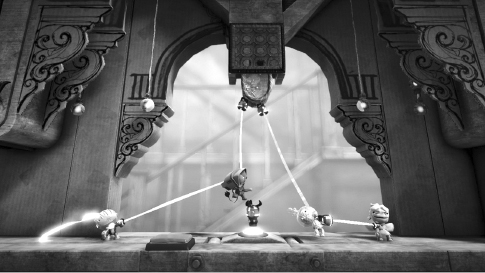
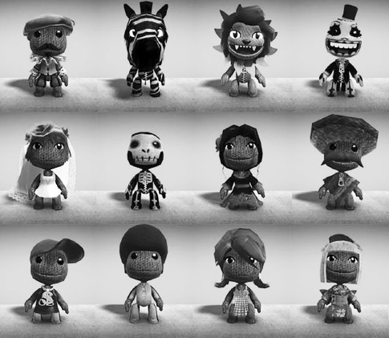
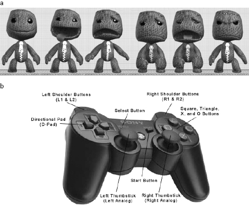
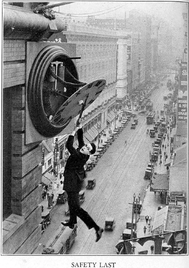
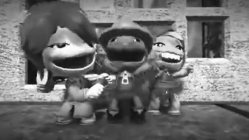
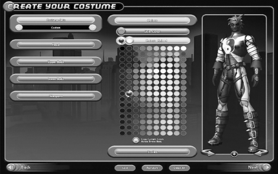
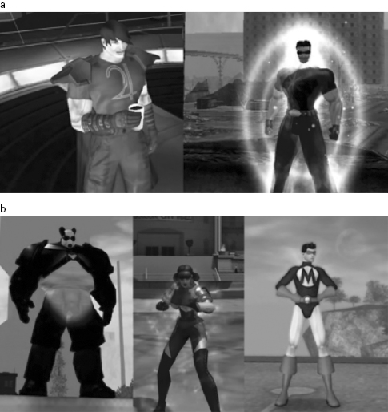
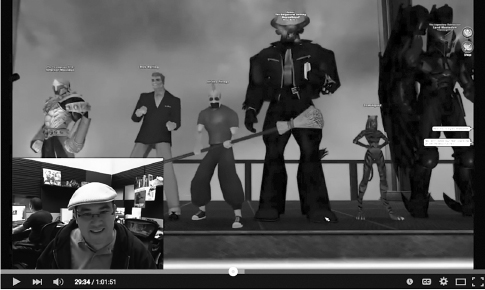
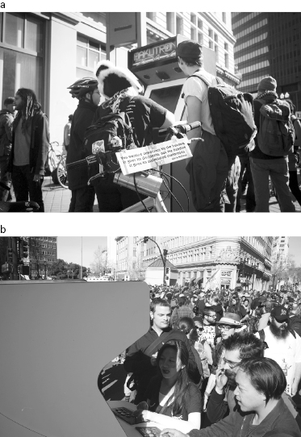
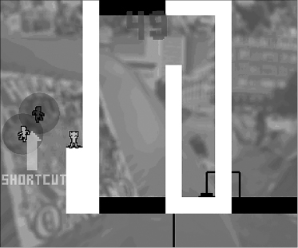

# 2 Social Play: Designing for Multiplayer Emotions

# 2 Social Play: Designing for Multiplayer Emotions

## Why Playing *Together* Matters

The isolated gamer sits alone, face illuminated by the blue glow of the screen, lost in a solitary trance. It’s a familiar image from movies, TV, and popular culture in general. But the stereotype of the pasty-faced, antisocial game addict belies what we actually know about gamers. In fact, the majority of people who play digital games play them with others.[1](#c2-note-1) This shouldn’t be surprising: from playground tag to chess, card games, and board games to *Minecraft* and *Call of Duty*, the long history of games is primarily a story of rules and equipment created to engage people together socially.[2](#c2-note-2) When we humans play (aside from the occasional game of solitaire), we usually play together. So before we can grasp the emotional impact of digital games, we need to understand what happens in social games more broadly.

What’s different emotionally about social play compared to, say, solitaire?

We know social interaction in general is deeply consequential to human flourishing. Without it, we wither and become despondent, even physically ill.[3](#c2-note-3) Social play, then, helps address one of the most fundamental of human needs, in ways that solo play (even with charismatic NPCs) probably doesn’t. Game researchers have found that emotional responses change when players compete against real people rather than computers. In one experiment, Canadian researchers Mandryk and Inkpen[4](#c2-note-4) invited experienced digital gamers to bring a friend to their lab, where both played a digital hockey game. Each person played in two different situations—against the computer, and against his or her friend. Using both questionnaires and physiological measures (galvanic skin response [GSR] and muscle activity measured using electromyography [EMG]), the researchers tried to identify differences in how the players experienced each condition. Not surprisingly, they found that people preferred social play. Both the questionnaires (which measured the players’ conscious perceptions and preferences) and the physiological measures (which might have differed from the players’ self-reported experience) consistently found that playing with a friend led to higher ratings of engagement than playing against the computer. Further, while players reported more boredom when they lost against the computer than when they won, they were equally engaged when playing a friend, whether they were winning or losing. These results corroborate findings from studying the shared experience of other media as well (e.g., social television watching[5](#c2-note-5)). The upshot: it’s more fun to play together than alone.

In chapter 1, we looked at how meaningful choices make gameplay different than experiences of film, television, and novels. Playing together brings meaningful choices into the social interactions of gameplay. To be sure, people socialize during other mediated experiences—laughing and chatting over a TV show or movie. But gameplay is different. When playing together, you and your fellow players take in-game actions that have real consequences for one another’s moment-to-moment experience, as well as consequences for one another’s in-game virtual bodies and selves. Thus games provide us with opportunities for both sociability *and* social play.[6](#c2-note-6) To go back to the snowboarding game example, if I play it with a friend, we’re not only trying on the sport and alternate identities (as world-class snowboarders), we’re also having fun together—racing past one another on the virtual slopes and doing tricks (and surviving spectacular wipeouts) for one another’s benefit. Games are unique among media in allowing us to have this active experience together.

This chapter introduces three building blocks designers use in social digital games to evoke rich emotional responses in players: coordinated action, role-play, and social situations.

## Coordinated Action

There is something deeply satisfying and bonding about overcoming a challenging mental and physical situation with someone else, especially if it requires close coordination. If you’ve ever played team sports, or found yourself in an impromptu collaborative situation (getting a car out of a snowdrift, rescuing someone’s wind-scattered papers), then you know these feelings. Social psychologists have demonstrated that giving people opportunities for coordinated action (like asking them to lift and carry boards together) leads to greater feelings of connectedness, mutual liking, and rapport.[7](#c2-note-7) Games can facilitate this kind of collaboration over an extended period of time, spanning hours, weeks, even years.

The Sony Playstation 3 game *Little Big Planet* showcases the simple pleasures of coordinated action with an elegant set of design choices. Launched in 2008, the game was in its third release, in 2014, and still going strong. *Little Big Planet* is a puzzle-platformer, a game genre in which player avatars solve physical puzzles in a two-dimensional world of platforms (see [figure 2.1](#fig_001)).

[Figure 2.1](#fig_001a) *Little Big Planet* players coordinate avatar actions to solve puzzles.

*Source:* *LittleBigPlanet 2* (MediaMolecule, 2011)

The avatars can take a simple set of actions—running, jumping, pushing, and pulling—in a world seemingly made of fabric and paper. While the game’s look and feel resemble a child’s craft project, its sophisticated physics engine makes objects behave more realistically than in other platformer games (e.g., an object sliding down a hill will gain speed until it collides with something or the slope changes).

Players build avatars from a simple base body referred to as “Sackboy,” decorating these simple bodies with costuming elements and “stickers” (see [figure 2.2](#fig_002)). In an unusual twist, *Little Big Planet* lets players puppet the avatar’s face and body to convey emotions. Players can adjust the character’s happiness, fear, sadness, and anger using the Directional pad (D-pad) on the controller (see [figure 2.3a, b](#fig_003); see also a brief online tutorial on puppeteering the avatar).[8](#c2-note-8) Trigger buttons and tilt controls let players move, gesture, and even slap other players’ avatars.

[Figure 2.2](#fig_002a) *Little Big Planet* avatars are built upon a base avatar body known as “Sackboy.” Players have a great deal of latitude in customizing the figure with costuming elements and “stickers.”

*Source:* *LittleBigPlanet 2* (MediaMolecule, 2011); image taken from Wikipedia

[Figure 2.3a, b](#fig_003a) Happy, very happy, sad, more sad, saddest, and angry expressions for Sackboy, which can be controlled by the player using the D-pad on the game controller.

*Source:* *LittleBigPlanet* (MediaMolecule, 2008); image courtesy of H2-Blog

The avatar customization tools and expression controls make these characters feel like handcrafted puppets that the player is both operating and inhabiting in the game world. Unlike the Sims, sack creatures never speak—they express themselves only through their broad body language and facial expressions (not unlike comic silent film actors—see [figure 2.4](#fig_004)). The game’s physics allow for physical antics and complex physical puzzle solving that make the avatars feel expressive and realistic to players despite their simplified bodies.

[Figure 2.4](#fig_004a) *Little Big Planet*’s avatars and game mechanics evoke the classic physical humor and sense of adventure and risk of silent film stars like Harold Lloyd.

*Source:* *Safety Last!* (Hal Roach Studios, 1928)

*Little Big Planet* encourages social play by design. The game can handle up to four players, either local (i.e., everyone is in the same room, watching the same screen) or online (connected from different locales and screens through the Sony PlayStation network). Some of the puzzles in every level can only be solved through the cooperation of two or more players.

Players solve puzzles physically (and through side conversation if they are in the same room), figuring out whose avatar needs to stand where, or press on what, in order to solve the problem. Players can use the avatars’ ready emoting to give one another silent commentary on how things are going, and can physically ham up victory and defeat ([figure 2.5](#fig_005)).

[Figure 2.5](#fig_005a) Players can make avatars ham it up with facial expressions and broad body language.

*Source:* *Little Big Planet* “Sackzilla” trailer, YouTube (“calculatorboyqwe”)/MediaMolecule (2008)

As one writer describes his play experience:

> Helen calls them the “Hurrah!” buttons. L2 + R2 + both analog sticks held upwards. Whenever she wins the most points on a *Little Big Planet* level, she presses these buttons, and her grinning Sackgirl lifts both arms in the air in wordless celebration. My Sackboy, meanwhile, tends to scowl and storm off the side of the screen, fists clenched. Or, after a particularly stressful level, he might pull out a frying pan and hit Helen’s Sackgirl over the head. Helen tends to take losing slightly better. She will drag my Sackboy away from the camera, mid-disco dance, in a vain attempt to take the spotlight. Either way, nigh every level ends in a comical scuffle between our characters without a word spoken between us in the real world.[9](#c2-note-9)

This same writer notes that the controls in *Little Big Planet* allow for rich nonverbal communication between players, immersing them more thoroughly into their characters and the game world: “Instead of Helen telling me to ‘go over there,’ and pointing at a corner of the television screen, Helen’s Sackgirl herself points at a switch within the world and my Sackboy goes there. When he finds the wrong switch, Sackgirl shakes her head angrily and points again. This time my Sackboy gets it right, and Sackgirl grins and gives a thumb up.”[10](#c2-note-10)

The original game shipped with many wildly creative prebuilt levels, but the enduring popularity and power of the game derives from the ability to make and share custom levels, including avatar designs. A simple in-game movie showing a player creating a “Sackzilla” and “terrorizing” a city before being defeated by other players[11](#c2-note-11) shows the range of character styles and emotions that players can put together to create compelling and entertaining scenarios. Anyone can easily download player-created levels and invite others to play. For further customization, *Little Big Planet*, like *The Sims*, offers popular content packs with avatar accessories and costumes ranging from pirates to historical figures to Norse gods.

*Little Big Planet*’s design choices—simple and emotionally puppeteer-able avatars, interesting physics, limited group size, puzzles that require teamwork—create a fun form of coordinated action. These choices also set the emotional tone by delimiting which actions are possible. Simple, comical avatars with controls that make physical antics and comedic interaction easy help lead players into a friendly and silly shared emotional experience as they work together.

## Social Avatars and Role-Play

As we saw in chapter 1, avatars enhance emotional experience in solo play. This is even more true in multiplayer situations. When people play together as avatars, the game transforms from a private, personal journey into real social interaction.

Taking on a virtual self in a multiplayer setting brings the gaze and expectations of other players to bear on a player’s adopted in-game identity. When I perform another self in the presence of other people, all of us are engaged in actual real-time social interaction taking place through the lens of this playacting. At the same time, we are also immersed in our own role performance viscerally and cognitively. This opens up the possibility for powerful emotional experiences that arise out of a co-performance of roles while engaging in rich, genuine shared experiences. Game designers combine avatars and actions to generate rich possibility spaces for emotionally meaningful social interaction. The game worlds they create may be imaginary, but the social dynamics are not.

In everyday life, human beings inhabit and perform myriad social roles—sister, parent, coworker, student, lover, house guest—as the situation and others around us demand. Sociologist Erving Goffman observed that people enact performances of these roles, presenting the self in a social context toward the outcomes they desire.[12](#c2-note-12) For example, we may put on a happy face when visiting neighbors, regardless of how we’re actually feeling, so as to properly enact the polite visitor. This is not to say that all our social roles are arbitrarily and freely chosen. In fact social roles usually shape and constrain individual behavior, creating a more manageable experience for everyone. The roles we can inhabit in the “real” world are profoundly shaped by many factors, including inborn characteristics, family environment, professional training, and the relationships we have and intend to maintain. Game avatars allow us to peel away some of these layers and adopt alternative identities.[13](#c2-note-13)

Even in this era of advanced graphics, the most malleable material for digitally crafting identity and social interaction is still text. As we saw in chapter 1, in the case of *Planetfall*’s Floyd, a few well-chosen words can form a rich and eloquent description of an environment or character. If a game world is built to allow for a lot of player customization in avatars, text can make complex identity construction and role-play possible. Text-based MUDs (Multi-User Dungeons) take advantage of these characteristics of text to provide a rich shared imaginative world for players.

While MUDs have existed since the 1970s, the player base of these games expanded broadly for a time in the early 1990s, as college campuses gave students network access and public awareness of the Internet grew. In a MUD or MOO (Multi-User Dungeons, Object Oriented), players forge their avatars and the virtual environment they inhabit through rich descriptive text. Here, for example, is what you might read as you enter the long-running LambaMOO:

> The Coat Closet. The Closet is a dark, cramped space. It appears to be very crowded in here; you keep bumping into what feels like coats, books and other people (apparently sleeping). One useful thing that you’ve discovered in your bumbling about is a metal doorknob set at waist level into what might be a door. There’s a new edition of the newspaper. Type “news” to see it.[14](#c2-note-14)

By writing verbal descriptions others can view, players can create just about any kind of persona for themselves in these text-based worlds. As one player said in Sherry Turkle’s 1995 book:

> You can be whoever you want to be. You can completely redefine yourself if you want. You can be the opposite sex. You can be more talkative. You can be less talkative. Whatever. You can just be whoever you want, really, whoever you have the capacity to be. You don’t have to worry about the slots other people put you in as much. It’s easier to change the way people perceive you, because all they’ve got is what you show them. They don’t look at your body and make assumptions. They don’t hear your accent and make assumptions. All they see is your words. And it’s always there. Twenty-four hours a day you can walk down to the street corner and there’s gonna be a few people there who are interesting to talk to, if you’ve found the right MUD for you.[15](#c2-note-15)

Turkle’s research showed that people do serious emotional and social work as they play in these environments. One girl who lost part of her leg in a car accident created a character in a MUD who was also missing a leg. She described the character’s disability and her prosthesis front and center in the description other players saw upon meeting her.

This meant that everyone who befriended her character in the MUD worked through any issues they might have with her handicap. This included someone that the girl became romantically involved within the MUD. As Turkle puts it:

> She and her virtual lover acknowledged the “physical” as well as the emotional aspects of the virtual amputation and prosthesis. They became comfortable with making virtual love, and Ava found a way to love her own virtual body. Ava told the group at the town meeting that this experience enabled her to take a further step toward accepting her real body. “After the accident, I made love in the MUD before I made love again in real life,” she said. “I think that the first made the second possible. I began to think of myself as whole again.”[16](#c2-note-16)

While MUDs and MOOs leverage the flexibility of text, more recently designed multiplayer online games take advantage of the power of graphics and physics to frame deeply immersive avatar-based role-play experiences for players. In *City of Heroes*, a massively multiplayer online role-playing game (MMORPG or MMO) that ran from 2004 to 2012, players took on comic-book-style superhero identities. If you ever played superhero as a kid (I personally remember whirling in front of my mirror hoping to transform like my hero, Wonder Woman), you’ll understand the appeal of this game.

*City of Heroes* offered players the chance to create and then inhabit and enact their very own superhero within the game, battling criminals and saving the world alongside other players/superheroes.

The game’s designers built a multilayered avatar customization system that made creating a superhero identity a much deeper process than simply choosing a costume. The players’ possible choices were closely tied to the core gameplay action, so they could truly *have* superpowers within the gameplay context. *City of Heroes* provided four sets of avatar-creation choices. The first two tied tightly to gameplay features built into the game engine. The second two had no impact on the game’s behavior, but plenty of impact on other players’ responses.

First, the player chose between five main character archetypes. MMO games typically make players choose a “class” of character to begin with when crafting an avatar (e.g., wizard, healer, warrior, etc., in a fantasy game). These different classes have different sorts of powers in the game world that work well together in group play. In some ways, classes resemble positions on a sports team. In soccer, you have players on offense and defense, subdivided into specialized roles. In MMO games, like soccer, people gravitate toward positions that suit their abilities, style of play, and enthusiasm for certain kinds of tasks in the game. *City of Heroes* players could choose from five main character classes (referred to as archetypes in the game): Blasters (strong fighters), Scrappers (great at close quarters, melee-style combat), and defensive specialist Controllers, Defenders, and Tankers.

After choosing an archetype, the player selected from one of five origin stories: science, mutation, magic, technology, and natural. The origin affected what sorts of enhancements the player could acquire and the types of enemies she was most likely to face. For example, if the player chose the science origin story, her story, though customizable, would follow this general scenario from the game:

> You received your powers either through purposeful scientific inquiry or some accident gone awry. You have since learned to harness your newfound abilities, becoming a powerful force in the world. This origin will give you access to Tranq Dart. This item has a very short range and deals minor Lethal and Toxic damage. In addition there is a small chance you can put the target to Sleep with this dart, but they will wake up the next time they are damaged or healed.

A player with the science origin would have access to training, invention, genetic alteration, and experiment enhancements as gameplay progressed.

In contrast, the technology origin overview read as follows:

> You derive your powers from technological devices, from suits of high-tech body armor to powerful energy weapons. Few have been able to duplicate the amazing technology that lies behind your gadgets. You need not be a brilliant inventor; you may have acquired these items from another source. This Origin will give you access to Taser Dart. This attack has a very short range and does minor Energy damage. In addition it has a small chance to Hold your opponent for a brief moment.

Enhancements available with this origin choice included training, gadget, invention, and cybernetic.

These overviews show the interweaving of high concept and concrete implications for gameplay. The game designers walked the player through the process of coupling fantasy backstory with pragmatic implications of avatar choices on abilities and likely gameplay outcomes. From here, the player selected one primary power set (such as broadsword, claws, or katana) and one primary power for that set (such as nimble slash or sweeping strike, two possible powers for the dual blade primary power set). These powers were just the start for the player, who could progress through gameplay to acquire more and more strength and ability, as well as enhancements based upon the Origin story that was selected.

After making these gameplay-relevant choices, the player could select from a tremendous range of appearances (see [figure 2.6](#fig_006)), choosing gender (male, female, or “huge”), height, weight, features, and a detailed variety of costumes. In the last phase of avatar creation, the player registered the avatar, making a final set of choices, including a battle cry and a character description for other players to read.

[Figure 2.6](#fig_006a) Customizing the avatar’s costume for *City of Heroes*.

*Source:* *City of Heroes*, Venturebeat (“Layton Shumway”)/NCSOFT (2010)

This deep set of avatar choices gave tremendous latitude to players in crafting their own fantasy figures. As one player puts it, the variety of options and ability to author an origin story “made my CoH characters seem like *my* characters, not some generic gear clotheshorse constructed out of a handful of possible hair and body options.”[17](#c2-note-17) Another notes: “Oh man. The origins you could write in. . . . I ran into random players, and reading their origins, just instantly hit it off, and had great, memorable missions—or even just *conversations*—that I still remember.”[18](#c2-note-18)

When the game was closing down, nostalgic players gathered on forums to share stories about their in-game time. One thread included players’ favorite character descriptions.[19](#c2-note-19) Here are a few examples demonstrating the humor, creativity, and ingenuity players applied in their choices:

> • “The Killustrated Man: Who had a lot of tattoos and was good at martial arts.”

> • “Regina Dentata: The queen of teeth.”

> • “Organised Mime: He was an evil mime who was super strong and awesome to play.”

> • “The Hundred Acre Hood: oh bother.”

> • “Drach Terra: Very colourful demon from a dimension of law and order.”

> • “Melissa Kane: Formerly a teacher in a school for superpowered children. Now a Revenant out for Revenge.”

> • “Thunderblitz: Psychotic and Omnicidal Cyborg made from the DNA of a narcissistic supervillain, steampunk technology and powered by an arcane reactor stolen from the Circle of Thorns.”

> • “That Other Kid: Stuntman who after too many knocks on the head believes that she’s actually a super hero. Runs around Paragon City waving a Katana and quoting Quentin Tarantino movies.”

> • “Swamp Fever: A scientist who merged himself with hallucinogenic swamp plants.”

> • “I remember in CoV I had a guy in a white suit with White hair and a beard/moustache combo with chicken legs simply called ‘The Colonel.’”

> • “My first char ever was Miss Information, a villainous secretary out to bring down terrible executives who abused their powers. Then I made Strychnina, and was playing her until GW2 came out. She was a Russian scientist who accidently spliced plant genes into herself and became an angry poisonous woman (no one would love her):).”

[Figure 2.7a, b](#fig_007) shows some examples of player-created avatars shared on forums about the game. [Figure 2.8](#fig_008) shows one of many in-game costume contests the game developers held for players.

[Figure 2.7a, b](#fig_007a) *City of Heroes* players were able to create a tremendous range of avatars to support their superhero fantasies.

*Source:* *City of Heroes* (Cryptic Studios, 2004); screenshots courtesy of NCSOFT

[Figure 2.8](#fig_008a) *City of Heroes* in-game costume contest.

*Source:* *City of Heroes*, YouTube (“NCsoft’s Official City of Heroes Video Channel”)/NCSOFT (2012)

In addition to the extensive set of avatar customization choices, the game’s developers provided detailed backstory and related tasks and challenges, updating and extending them during the years of the game’s run, to activate players and unite them in their adventures in Paragon City. This lore included a rich cast of characters, some inhabited and performed in-game by the company founders. The company even produced special edition comic books released alongside the game. As one player put it: “One of the best things about this game was the lore, how in-depth it was and how different, seemingly disparate storylines ended up linking back together the more you learned about the origin of the NPC heroes and villains.”[20](#c2-note-20)

Players could also author their own missions and story arcs, using the mission architect feature. The game offered multiple ways to have group adventures—players could form leagues and task forces, and also use a sidekick feature in which one player joined with another to play together regardless of their level of mastery in the game. *City of Heroes* also featured cross-server chat, a rarity in MMOs. (This meant that a player logged into the game could chat with any other player logged into the game, even if their play was taking place on a different server.)

The combination of all these features contributed to players’ emotional and social engagement—deep avatar customizability linked integrally to gameplay and framed with a rich and evolving backstory, and a variety of ways to play together and stay connected. The designers of *City of Heroes* made the most of the MMO format and its capabilities, to provide players with an engaging shared superhero experience. Players remarked on how well the game delivered on the superhero premise: “That was what I really loved about CoH. They made the powers really feel unique and tried their best to give you the real, full benefits of them and make you feel like a super hero.” “One of the best memories was running this mission with an impromptu super group, all exchanging stories of how we got our costumes while beating up thugs in a junkyard. Whoever said that writing your own character’s backstory for others to read was the best was right. So much fun.”[21](#c2-note-21)

*City of Heroes* brought the superhero myth to gamers in a dynamic way interwoven with their social lives both in and out of game. One player remarked: “City of Heroes was how I met my best friend. We met talking about it at lunch in jr. high.” Ironically, another remarked: “When I first heard about this game my friends and I wanted to play it so bad we ran around the school yard pretending to be superheroes.”[22](#c2-note-22) As with many MMOs, devoted players logged many hours of their time in the game, playing for years, sometimes with the same people. At the shutting down of the game’s servers in 2012, one player dove in for a last round and posted:

> Well. That’s it. City of Heroes is done as of about five minutes ago. I was there for the end, and I’m glad. It’s like visiting a relative on their deathbed; I really, really, didn’t want to, but I’m already glad I did. A friend I’d made in the game and played with seven years ago—seven years ago—was on with her original character. We chatted and traded Facebook info. I used to help her with her math homework. Turns out she’s married now, to a dude she met in the game. She doesn’t MMO much anymore, but at least now we can keep in touch. I was there on the first day and the last. It feels right, I guess, as right as anything can.[23](#c2-note-23)

## Social Situations

When creating multiplayer games, designers act as social engineers—using game elements to create social situations that are interesting and compelling, scenarios where players have fun *together*. Psychologists, most notably Walter Mischel, have long pointed out the powerful influence of social situations on the way individual personalities show themselves.[24](#c2-note-24) Game designers set up situations aimed at bringing certain kinds of actions and impulses to the fore, thus creating the emotional and social responses that they would like people to experience together. Some game designers take an active ethical stance toward cultivating certain kinds of social situations and desired outcomes for players that reflect their values.[25](#c2-note-25)

For example, Anna Antropy’s *Keep Me Occupied* ([figures 2.9a, b](#fig_009) and [2.10](#fig_010)), created for the 2012 Occupy Oakland movement, was carefully crafted to reflect and enhance movement participants’ aim of building upon one another’s efforts toward the common good.

[Figure 2.9a, b](#fig_009a) Players of *Keep Me Occupied* (a game built and deployed during the Occupy Oakland movement in 2012).

*Source:* Shaun Roberts ([www.shaunroberts.net](http://www.shaunroberts.net)) (2012)

[Figure 2.10](#fig_010a) Each player is assigned a unique avatar color in the game, so that they can find themselves in the game state later. Players work together to open gates, and past players’ avatars are left behind holding open gates for others so they can build upon the work of those who went before them.

*Source:* *Keep Me Occupied* (freeware, 2012); image courtesy of Anna Anthropy

Antropy explained in a post that she designed *Keep Me Occupied* as an arcade-style cabinet game intended to go in an abandoned building that the movement planned to occupy; the cabinet had wheels and would travel around Oakland when not in the building. She wanted a game where every player would contribute to the collective success of the group. She describes her idea as follows:

> The two players are working together to get as high as they can in sixty seconds. when the sixty seconds are up, each player leaves her avatar behind to stand on the last switch she touched, holding it open for everyone who plays the game afterward. (every player gets a different color so she can recognize her avatar later.) as more and more gates are permanently opened, it’s easier for players to get farther in the sixty second time limit. what was important to me was that even less-skilled players could contribute—they might only make it as far as an early set of switches, but because more successful players hadn’t occupied those switches yet, these players could hold them down and save all future players the time they would have otherwise spent on them. i also liked players having the choice of making voluntary sacrifices to help future players, so i included shortcuts that allowed players to bypass big portions of the game, but required a player to opt out of advancing upwards in favor of occupying the switch.[26](#c2-note-26)

About forty people were able to play the game before a very violent police crackdown on the marchers that made the international news. They never made it into the buildings they intended to occupy. The protestors pushed the heavy arcade cabinet along with them and, when the march regrouped, put it away in the sound truck for another day.

*Keep Me Occupied* is easy to play, and the cumulative and collective nature of the experience is unique. The simple avatars encourage ready and universal identification, and yet the individual coloring allows players to go back and see their contribution to the whole. The task is easy to grasp, the controls familiar, and the feel of the game is (literally) uplifting (the characters soar ever higher in the level as they open gates). Play cycles are very short—sixty seconds—and the arcade cabinet provides a familiar play context visible from afar, encouraging spectators and turn-taking. *Keep Me Occupied* shows how minimal design and a clear emotional goal can create a desired end experience for players. Antropy made a series of savvy design decisions to craft a social situation for players that mirrored their hopes and aspirations for their social movement work.

*City of Heroes* also offers a designed social situation. Players craft superhero personas and play out their superpower fantasies within the parameters provided. The missions, the lore, and the progression of powers all help guide their performance—to keep it in “bounds.” Along the way they get to know other players, and form affections for, and connections to, them based on shared in-game activities. The designed social situation is heroic and epic, in the tradition of the comic book fantasies upon which the game is based.

But designer intentions and programmed boundaries can be warped and even actively transgressed. Players have always enjoyed exploring these limits. Indeed, this can be an integral part of the joy of play.[27](#c2-note-27) Designers of MMOs stress the importance of working with players as they explore and renegotiate what is possible and desirable in play.[28](#c2-note-28) Sometimes players ferret out an imbalance in the inherent powers of the avatars, and vote with their feet, or exploit certain reward systems in ways that may force the game to change.

Such changes can sometimes lead to serious conflicts within a game community. New Orleans researcher David Myers[29](#c2-note-29) had been playing *City of Heroes* for quite some time, and had an advanced character named Twixt who was reasonably well known and respected. The developers of the game introduced a new PvP (player versus player) scenario available only to advanced players. As Myers puts it: “It became increasingly evident that these newly competitive play elements opposed and, in the opposition, revealed the game’s cooperative play norms. In a sense, by introducing PvP competition, the designers of *CoH/V* had Garfinkeled their game. I further explored this with Twixt.”

What Myers means here by “Garfinkeling” is a technique originated by sociologist Harold Garfinkel. Garfinkel and his students studied the creation and preservation of social order. They conducted “breaching experiments,” where they would violate social norms—by, perhaps, standing very close to a conversation partner, or bargaining in a department store—and observe how people tried to repair or restore order.

To Garfinkel *City of Heroes*, Myers violated the game’s well-established norms of cooperation and collaboration by following the exact letter of the new PvP mode without acknowledging or deferring to the social rules that had emerged in the larger game community. For instance, rather than giving opponents a sporting chance, he might use his powers to transport opponents to a robot firing line where they had no chance of fighting back or surviving. As he explained, “At first, my interest was solely in adapting and perfecting Twixt’s play to accomplish the PvP game goals. I did not expect anything like the severity—or the ferocity—of what occurred as a result.”[30](#c2-note-30)

Twixt’s opponents took enormous offense at what was perceived as his antisocial behavior. In addition to denigrating Twixt as a coward on chat servers, they repeatedly appealed to game moderators to kick Twixt off the game. They derided him as a low-skilled player, despite his high ranks and stats: in fact, players persisted in denying Twixt’s skill even when confronted with logs from the game. Twixt’s own in-game group expelled him for his behavior, despite their long-standing play relationship. He even received a sort of death threat: “10-09-2006 [*Broadcast*] i swear if i ever meet you i will physically kill you for real.”

Myers found this violent and sustained social reaction to his in-game behavior fascinating, as it revealed a strong player culture of cooperative play even when faced with new rules, competitive elements, and rewards structures. Although a more competitive, individual-focused play atmosphere had proven appealing in many other MMOs, in this case, players rose up to protect the communal feel of the gameplay that had emerged among them over time. One might say that the initial social situation of *City of Heroes*—communal, heroic behavior—took on a sustained life of its own in players’ behavior and expectations, one that overrode the designers’ subsequent attempts to tune or tweak the game’s social experience. Players had developed personas and shared memories of role-playing under certain rules, official or otherwise, and did not want to upend this shared history in the more advanced, more competitive levels of play.

## Wrapping Up

In multiplayer gaming, the meaningful actions that make up each individual’s gameplay experience combine to create real social experiences between players, despite the “virtual” nature of the world they find themselves in. Designers leverage the emotional heft of coordinated action and expression in games like *Little Big Planet*. They provide rich tools for engaging in social role-play using avatars, as we saw in *City of Heroes*. And they craft social situations to cultivate certain kinds of social and emotional experiences for players, as in *Keep Me Occupied*.

Avatars in multiplayer contexts allow people to explore fantasy identities and powers, and to enact them with one another over time, sharing what are in fact “real” experiences. The hybrid nature of these experiences, which are both virtual and real, brings a social charm of its own. Consider, for example, the slapstick nonverbal interactions between Helen and Brendon (described above) in *Little Big Planet*.[31](#c2-note-31) Or the delight in peeking at another player’s backstory in *City of Heroes* and striking up a conversation that leads to a lasting friendship.

These examples and others in this chapter (from trying on life with a missing limb to vehemently protecting a valued game culture) clearly demonstrate how players can become highly engaged, even transformed, when they inhabit avatars and interact in social gameplay, however artificial and fantastic their digital “virtual” surroundings may be. Game designers are, in effect, molding our social milieu and the way we build ties with one another, as well as shaping how we see ourselves.

They are also providing us with contexts for forming real and meaningful relationships through role-play that can somehow become part of a person’s lasting identity. As game researcher and designer Celia Pearce describes her relationship with an avatar she named Artemisia:

> When I log off of these worlds—when I untransform, or retransform, from Artemesia to Celia—Artemisia pops off the screen. The screen image of the various “mes” dissolves like a bubble, but Artemesia still exists inside Celia: she is still part of the complex of mes that is both Celia and Artemesia. . . .
>
> . . . I, as Artemesia, am also present to others when I am not in-world. I am in their memories, remembered, referred to, imagined; thus, in some sense, I remain “real,” even when I am not present, for those who have seen and played with me online. . . . We who inhabit avatars all know each other in this way. We can hold multiple identities both within ourselves and in our conceptions of each other.[32](#c2-note-32)

I would argue that no other medium offers this kind of transformative power at the individual and social levels. And game designers continue to push the boundaries of their medium to artfully frame players’ explorations of their interconnected identities, as we’ll see in the next two chapters.

## Notes

[1.](#c2-note-1a) Entertainment Software Association, “Essential Facts about the Computer and Video Game Industry,” 2015, <http://www.theesa.com/wp-content/uploads/2015/04/ESA-Essential-Facts-2015.pdf> (accessed August 26, 2015).
[2.](#c2-note-2a) Johan Huizenga, *Homo Ludens: A Study of the Play Element in Culture* (Boston, MA: Beacon Press, 1955).
[3.](#c2-note-3a) Hara Estroff Morano, “The Dangers of Loneliness,” *Psychology Today*, July 1, 2003, <https://www.psychologytoday.com/articles/200308/the-dangers-loneliness> (accessed August 26 2015).
[4.](#c2-note-4a) Regan L. Mandryk and Kori M. Inkpen, “Physiological Indicators for the Evaluation of Co-Located Collaborative Play,” *CSCW ’04 Proceedings of the 2004 ACM Conference on Computer-Supported Cooperative Work*, Chicago, IL (2004): 102, doi:10.1145/1031607.1031625.
[5.](#c2-note-5a) Anna Macaranas, Gina Venolia, Kori Inkpen, and John Tang, “Sharing Experiences over Video: Watching Video Programs Together at a Distance,” *Human–Computer Interaction—INTERACT 2013*, Cape Town, South Africa (2013): 73–90.
[6.](#c2-note-6a) Jaako Stenros, Janne Paavilainen, and Frans Mäyrä, “The Many Faces of Sociability and Social Play in Games,” *Proceedings of the 13th International MindTrek Conference*, Tampere, Finland (2009): 82–89.
[7.](#c2-note-7a) Kerry L. Marsh, Michael J. Richardson, and R. C. Schmidt, “Social Connection through Joint Action and Interpersonal Coordination,” *Topics in Cognitive Science* 1, no. 2 (2009): 320, doi:10.1111/j.1756-8765.2009.01022.x; Pierecarlo Valdesolo and David DeSteno, “Synchrony and the Social Tuning of Compassion,” *Emotion* 11, no. 2 (2011): 262, doi: 10.1037/a0021302; Pierecarlo Valdesolo, Jennifer Ouyang, and David DeSteno, “The Rhythm of Joint Cction: Synchrony Promotes Cooperative Ability,” *Journal of Experimental Social Psychology* 46, no. 4 (2010): 693, doi:10.1016/j.jesp.2010.03.004.
[8.](#c2-note-8a) GameOn @ IGS Corporation Limited, *How to Control Sackboy: LBP2 Acting*, YouTube video, 1:50, October 21, 2011, <https://www.youtube.com/watch?v=LHF7Psvu6GM> (accessed August 26, 2015).
[9.](#c2-note-9a) Brendan Keogh, “A Sackboy Says No Words,” *Kill Screen*, March 15, 2011, <http://killscreendaily.com/articles/sackboy-says-no-words/> (acces­sed August 26, 2015).
[10.](#c2-note-10a) Ibid.
[11.](#c2-note-11a) calculatorboyqwe, *New LittleBigPlanet Sackzilla Trailer HD Quality*, YouTube video, 1:48, September 3, 2008, <https://www.youtube.com/watch?v=xdvSAkgN-FU&feature=player_embedded> (accessed August 26, 2015).
[12.](#c2-note-12a) Erving Goffman, *The Presentation of Self in Everyday Life* (New York: Anchor Books, 1959).
[13.](#c2-note-13a) D. Fox Harrell, *Phantasmal Media: An Approach to Imagination, Computation, and Expression* (Cambridge, MA: MIT Press, 2013).
[14.](#c2-note-14a) Michael S. Rosenberg, “Virtual Reality: Reflections of Life, Dreams, and Technology: An Ethnography of a Computer Society,” unpublished manuscript, 1992, <https://w2.eff.org/Net_culture/MOO_MUD_IRC/rosenberg_vr_reflections.paper> (accessed March 26, 2015).
[15.](#c2-note-15a) Quoted in Sherry Turkle, *Life on the Screen: Identity in the Age of the Internet* (New York: Simon & Schuster, 1995).
[16.](#c2-note-16a) Ibid.
[17.](#c2-note-17a) “Rip City of Heroes,” *Penny Arcade*, August 2012, <http://forums.penny-arcade.com/discussion/166289/rip-city-of-heroes> (accessed January 31, 2015).
[18.](#c2-note-18a) Ibid.
[19.](#c2-note-19a) Ibid.
[20.](#c2-note-20a) Ibid.
[21.](#c2-note-21a) Ibid.
[22.](#c2-note-22a) Ibid.
[23.](#c2-note-23a) Ibid.
[24.](#c2-note-24a) Walter Mischel, “Toward an Integrative Science of the Person,” *Annual Review of Psychology* 55 (2004): 1–22.
[25.](#c2-note-25a) Mary Flanagan, Daniel C. Howe, and Helen Nissenbaum, “Values at Play: Design Tradeoffs in Socially-Oriented Game Design,” *CHI ’05 Proceedings of the SIGCHI Conference on Human Factors in Computing Systems*, Portland, OR (2005): 751, doi:10.1145/1054972.1055076; Bernie DeKoven, *The Well-Played Game: A Playful Path to Wholeness* (Lincoln, NE: iUniverse, Inc., 2002).
[26.](#c2-note-26a) “keep me occupied,” *Auntie Pixelante*, January 9, 2012, <http://www.auntiepixelante.com/?p=1461> (accessed August 26, 2015).
[27.](#c2-note-27a) Espen Aarseth, “I Fought the Law: Transgressive Play and the Implied Player,” *Proceedings of DiGRA 2007 Conference: Situated Play*, Tokyo, Japan (2007): 130, <http://www.digra.org/wp-content/uploads/digital-library/07313.03489.pdf> (accessed August 26, 2015); Mia Consalvo, *Cheating: Gaining Advantage in Videogames* (Cambridge, MA: MIT Press, 2009).
[28.](#c2-note-28a) Raph Koster, “The Laws of Online World Design,” *Raph Koster’s Website*, <http://www.raphkoster.com/gaming/laws.shtml> (accessed January 31, 2015).
[29.](#c2-note-29a) David Myers, *Play Redux: The Form of Computer Games* (Ann Arbor: University of Michigan Press, 2010).
[30.](#c2-note-30a) Ibid.
[31.](#c2-note-31a) Keogh, *A Sackboy Says No Words*.
[32.](#c2-note-32a) Celia Pearce and Artemesia, *Communities of Play: Emergent Cultures in Multiplayer Games and Virtual Worlds* (Cambridge, MA: MIT Press, 2009), 216–217.

