# 3 Bodies at Play: Using Movement Design to Create Emotion and Connection

# 3 Bodies at Play: Using Movement Design to Create Emotion and Connection

Remember the lone gamer stereotype from chapter 2? The player you envisioned probably sat hunched over a keyboard or a game controller, focused intently on a screen, the only signs of life his frantically twitching fingers, and his rare outbursts of joy or frustration ([figure 3.1a, b](#fig_001)).

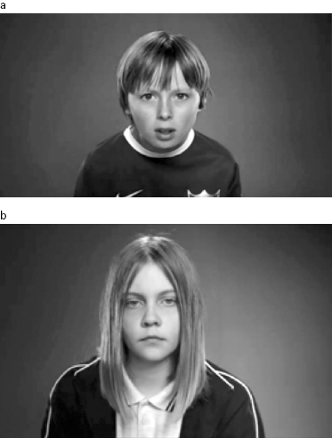

[Figure 3.1a, b](#fig_001a) Robbie Cooper captures the faraway stares of kids focusing on gameplay.

*Source:* Robbie Cooper, *Immersion*, New York Times Magazine video, 3:47, November 21, 2008, <http://www.nytimes.com/video/magazine/1194833565213/immersion.html>

Though it’s true that most people still play games “the old-fashioned way,” sitting in front of screens with handheld controllers, game designers have been shaking things up—literally. In the last few years, both independent and mainstream commercial games have started incorporating the vigorous, coordinated movement of bodies as a key element of gameplay.

There’s nothing necessarily wrong with sitting down, focusing hard, and using one’s hands. In fact, modern schooling and office work depends on just that, as does much problem solving and many creative pursuits (puzzles, fixing things, needlework, writing). Rather, it’s a matter of degree. Health researchers warn that we need to move more in daily life,[1](#c3-note-1) a mandate game designers have taken seriously, despite (or perhaps because?) of the blame they’ve taken for an epidemic of sedentary youth. In fact, game designers and developers are at the vanguard of innovating new styles of bodily engagement,[2](#c3-note-2) and they’re exploring new emotional terrain in the process. In this chapter, we’ll look at the striking impact that movements of the body can have on players’ emotional and social experience. I’ve focused much of my own research in the last few years on understanding how movement impacts players,[3](#c3-note-3) so in this chapter, you’ll see many examples from the work we do in my lab.

I’ll start with an overview of how and why movement directly impacts emotion, then show three ways game designers use movement to shape emotion and social connection—setting up physical challenges that provoke emotional responses, using movement to catalyze interesting social dynamics, and using the body as a vehicle for bringing players’ fantasy identities to life.

## Motion and Emotion

Researchers have designed some clever strategies for figuring out how our body affects our emotions. In one study, for instance, researchers had subjects hold a pencil between their teeth in one of two ways while completing various tasks: either with their lips pursed around the pencil (activating frown muscles in the face), or with their teeth clenched around it (activating smile muscles in the face). Subjects with the pencil in the teeth clenched/smile position said they liked the task more than the group with the pursed lips/frown position.[4](#c3-note-4) A person’s body posture can also affect his or her feelings. As social psychologist Amy Cuddy of Harvard explains in one of the most downloaded TED talks (24 million views), if I strike a “high-power” pose for a couple of minutes versus a “low-power pose” (see [figure 3.2](#fig_002)), then not only will I report feeling more powerful, but my body chemistry will also shift, producing more testosterone and less cortisol—a sign of lowered stress level.[5](#c3-note-5)

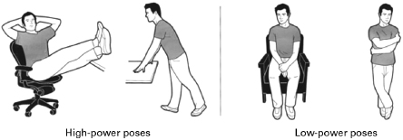

[Figure 3.2](#fig_002a) High-power and low-power poses affect a person’s self-reported attitude, as well as body chemistry and risk-taking behavior.

*Source:* Illustration courtesy of Jason Lee (originally appeared in J. Cloud, “Strike a Pose,” *Time*, November 10, 2010, <http://content.time.com/time/magazine/article/0,9171,2032113,00.html>)

Body-based emotional effects give game designers additional options for affecting players’ emotions. Kids use these effects intuitively on the playground. A pretend swordfight feels much more intense if you act it out with fake swords than if you sit on the floor with your friends knocking Playmobil knights together. When you swing and parry and duck and cover for real, you feel it more both in your body and your mind. You’re using your body to amp up the play experience.

Over the past ten years, every major gaming console device began offering movement-tracking hardware add-ons. Nintendo started the trend in 2006 with the Wiimote—a handheld controller that tracked motion using embedded sensors. In 2010, Sony introduced the Move, and Microsoft, the Kinect. These widely available devices make it possible for game designers to spark feelings in players by getting them to perform certain movements as a part of gameplay. If the game requires that I move around frantically, my brain will pick up my body’s physical signals and I will actually start to feel somewhat frantic. For example, *Wii Sports* boxing (see [figure 3.3](#fig_003)) encourages frenetic movement, which in turn creates a feeling of excitement and high energy in players.[6](#c3-note-6) Likewise, *Star Wars: The Force Unleashed,* lets players use physical motions to hurl on-screen enemies into the air and across the room with a simple and elegant flick of the Wii remote ([figure 3.4a, b](#fig_004)). After studying games like this, researchers have found that player emotions are in fact different during movement-based play than during controller-based play,[7](#c3-note-7) and have begun to explore more systematically what sorts of movement styles lead to what sorts of feelings.[8](#c3-note-8)

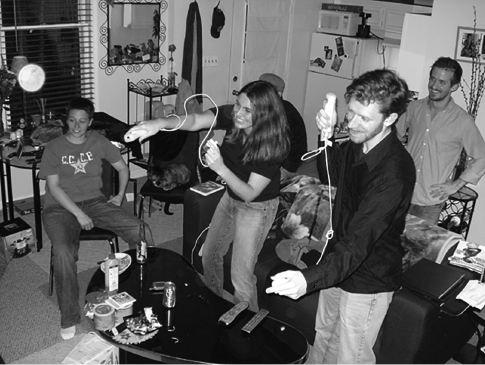

[Figure 3.3](#fig_003a) *Wii Sports* boxing encourages frantic movement from players, which creates a high-energy experience for them emotionally, in part as a result of their own movement.

*Source:* Photo courtesy of Lindsay Fincher (2008)

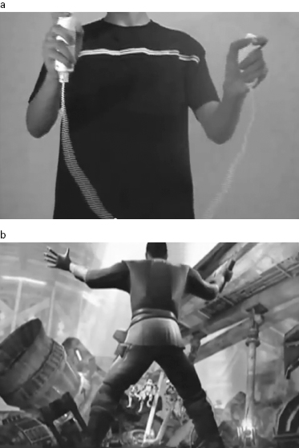

[Figure 3.4a, b](#fig_004a) *Star Wars: The Force Unleashed* used the Wiimote and Nunchuk movement controllers to allow players to “use the force” like Jedi knights. Here, the player raises several enemies with a gesture (<https://www.youtube.com/watch?v=VuzFzs0hPKc>).

*Source:* *Star Wars: The Force Unleashed* fan trailer, YouTube (“TNTv”)/LucasArts (2007)

Not only do our movements shape our own emotions, but they also affect anyone who’s watching us—emotions are, in a sense, “contagious.”[9](#c3-note-9) Our brains are predisposed to pick up and join in the emotions of other people. Neuroscientists have observed that certain neurons in our brains fire when we simply *watch* movement others make; these same neurons in our own brains fire when we make similar movements ourselves.[10](#c3-note-10) In other words, our brains seem to simulate what the other person is doing *and* feeling, running their actions and reactions through our mind, in the same way that we rehearse or perform our own actions. Conversely, other research looks at what happens when a person *can’t* physically imitate someone else’s movements, however subtly. One study found that people injected with Botox were not as sensitive to facial expression of emotion as people who had not been injected,[11](#c3-note-11) presumably because they could not move their own faces in sympathy with the faces of others they were trying to “read.”

Emotional contagion based on body movements offers two advantages to game designers looking to shape how players feel. First, anybody watching someone play will pick up on and (to some extent) share the emotions that the player acts out physically. This can cause an emotional snowball effect in a room where body-based social gameplay is happening. You can see this reflected in the faces of the spectators in figure 3.3. Second, avatars and NPCs can be leveraged to create feelings in players. If an on-screen character physically demonstrates signs of emotions, the designer can assume the player will pick those up and feel them to some extent as well.

For example, at the 2011 Game Developers Conference,[12](#c3-note-12) designers Dean Tate and Matt Boch described the many prototypes the team tested before coming up with the final version of their hit game, *Dance Central*. One version used the camera on the Kinect device to capture video of players dancing, and put that video on the screen so it looked as if players were really dancing in the game. It quickly became evident, however, that people didn’t like seeing themselves on-screen. They grew self-conscious and fixated on the awkward moves they made while learning new steps.

The designers realized it was better to eliminate the video and instead show a confident, smooth avatar representing the player on-screen (see [figure 3.5](#fig_005)). Essentially, the dancing avatar projected poise and confidence, and these “contagious” states “infected” players and boosted their own confidence.

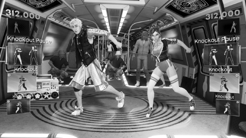

[Figure 3.5](#fig_005a) Player avatars from *Dance Central 2*.

*Source:* *Dance Central 2* (Microsoft Studios, 2011); screenshot courtesy of Shacknews

In this and other examples we’ll see, designers intuitively draw on what is known about emotions, the body, the brain, and social situations in order to deploy tools and strategies to shape player emotion. These strategies range from presenting satisfying levels of physical challenge, to evoking a bond between people through creating shared physical tasks, to the use of role-playing to generate new emotions and let players try on alternate identities. Body-based design broadens the emotional possibility space of games.

## Physical Challenges: Mastering the Body

As we covered in chapter 1, great games keep players just at the edge of their skill level in an optimal, “flow” state. This doesn’t happen by accident: designers artfully prepare and precisely dispense challenges to create an engaging experience. The ability to use the entire body for gameplay lets designers harness additional emotional power not possible in sedentary, hand-controlled games. It also adds another level of pleasure for players, by adding more complex and difficult challenges and rewards. Learning to master complex movements engaging the whole body brings a physical and mental pleasure that athletes and dancers know well. Intense physical activity itself can release chemicals in the body that produce a “high.”[13](#c3-note-13)

Increasingly, movement game designers are taking these effects into account to design compelling and sometimes surprising experiences for players.[14](#c3-note-14) For instance, when *Dance Dance Revolution* (*DDR*) swept college campuses a decade ago, it ended up delivering more than just a quirky and compelling game experience: it actually reshaped bodies. Many students reported weight loss after joining campus clubs or playing a lot in arcades and at home.[15](#c3-note-15) Studies reported that sedentary teenagers who played *DDR* for a while changed their attitudes about exercise and fitness.[16](#c3-note-16)

The impact of games on the body can extend to a wider range of experiences than amped up excitement and intensity. Relaxation and calmness are as deeply intertwined with the mind and body as agitation and excitement: calming the breath can tame one’s emotional landscape as well. In the Kinect-based game *Leela*, for example, the “Stillness Meditation” module uses the Kinect’s camera and depth sensors to give players visual feedback on their breathing, nudging them toward fuller and more relaxed breath cycles (see [figure 3.6](#fig_006)).

[Figure 3.6](#fig_006a) Visual feedback on breathing during *Leela*’s Stillness Meditation module.

*Source:* Deepak Chopra, *Leela* (THQ/Curious Pictures, 2011); screenshot courtesy of *Business Insider*

Many other games have also used bodily motion and breathing to drive a calming and meditative play experience, from Char Davies’s *Osmose* (1995)[17](#c3-note-17) to the more recent game *Deep* (2015). *Deep* combines the use of the Occulus Rift virtual reality headset with a custom controller that measures how much the diaphragm expands and contracts. The designer intended the game to quell anxiety in players, having built it as a response to his own struggles with anxiety.

Players seem to find it a powerful and useful tool. Christos Reid, a therapist who tried it at a conference, said:

> It was weird—I was trying to watch the game, but I had tears at the bottom of the Oculus headset because it calmed me down more than anything ever has in my entire life. I took it off after five minutes or so and [the designer]’s looking at me —he’d been at the mental health talk and he knew my input was valuable—and asked, ‘What do you think?’ It was really intense—I just started crying. I was just trying to get the words out because I was so emotional because I had never had such an effective anxiety treatment before. Nothing has ever helped me the way *Deep* did.[18](#c3-note-18)

Physical challenges from games don’t always require special hardware. In the cult game *Desert Bus*, created by magicians Penn and Teller during the CD-ROM boom and never officially released,[19](#c3-note-19) players use keyboard controls to simulate driving a bus through a desert for hours on end, which turns out to be physically and mentally grueling (see [figure 3.7](#fig_007)).

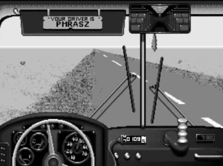

[Figure 3.7](#fig_007a) *Desert Bus* tests players’ stamina by requiring them to drive a difficult-to-steer bus through a virtual desert for hours and hours of real-time play.

*Source:* *Desert Bus* (Electronic Arts/Absolute Entertainment, 1995); screenshot courtesy of YouTube (“Phrasz013”)

As *New Yorker* reviewer Simon Parkin puts it:

> Finishing a single leg of the trip requires considerable stamina and concentration in the face of arch boredom: the vehicle constantly lists to the right, so players cannot take their hands off the virtual wheel; swerving from the road will cause the bus’s engine to stall, forcing the player to be towed back to the beginning. The game cannot be paused. The bus carries no virtual passengers to add human interest, and there is no traffic to negotiate. The only scenery is the odd sand-pocked rock or road sign. Players earn a single point for each eight-hour trip completed between the two cities, making a Desert Bus high score perhaps the most costly in gaming.[20](#c3-note-20)

The game was resurrected in 2006 and taken up by a group who decided to raise money by going on marathon “journeys” with it, creating a charity they called Desert Bus for Hope. So far they have raised over a million dollars by holding annual bus driving marathons.[21](#c3-note-21) Contributors clearly believe that the effort involved in “driving” the bus for hours is as worthy of support as a more obviously physical stamina-based challenge such as a walk-a-thon.

In another keyboard-based experience that makes players acutely aware of physical presence and effort, game designer Pippin Barr collaborated with performance artist Marina Abramović to adapt and extend some of the experiences Abramović offers to those who visit her institute in Hudson, New York. These exercises aim to enhance “your connection with yourself and with the present moment” (verbatim from the game instructions), and the emotional tenor of what unfolds depends upon each player’s attitude and approach. As in *Desert Bus*, the activities are deceptively simple and draw attention to small details of one’s physical actions. For example, one game requires players to walk their avatars up a ramp using the arrow keys, as slowly as possible (similar to walking meditation). Meanwhile, the player must keep the Shift key pressed down continuously to indicate presence and attention. Curious readers can try these games online.[22](#c3-note-22) But be ready to devote some time and focus—the site requests players to sign a certificate saying they will commit one hour to the experience, and exercises will time out for an hour if you let go of the Shift key once you begin.

Game artists have also explored a darker facet of physical experience—playing through physical pain and injury. In 2001, artists Eddo Stern and Mark Allen hosted a game tournament they called *Tekken Torture Tournament*. At the time, *Tekken* was the most popular fighting game for the Sony PlayStation. For this tournament, players wore devices that administered electric shocks to their arms (see [figure 3.8a, b](#fig_008)) when their on-screen avatars took blows. The shocks did not cause permanent damage, but they hurt; they also caused temporary movement difficulty that mimicked the delays avatars experience in-game after being dealt a heavy blow. Players had to sign an intimidating release form,[23](#c3-note-23) but nonetheless enthusiastically participated in the tournament as it toured art venues in the United States, Israel, Australia, and the Netherlands.

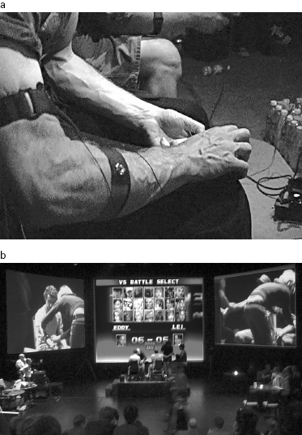

[Figure 3.8a, b](#fig_008a) During the *Tekken Torture Tournament*, electric shocks were administered to player’s arms when their on-screen avatars suffered damage.

*Source:* *Tekken Torture Tournament*, Eddo Stern (2001)

German artists Volker Morawe and Tilman Reiff took the exploration of pain and play a step further, creating a game machine that could, in fact, inflict physical harm. Their piece, originally titled *PainStation* but later renamed due to copyright issues with Sony, is a custom-built console (see [figure 3.9](#fig_009)) where two players compete in a *Pong*-like game.[24](#c3-note-24) Each player controls his paddle with the right hand, while the left rests on a part of the console the artists deemed the “Pain Execution Unit” (PEU). The PEU could heat up and administer electric shocks. It also contained a small wire whip that would pop out and strike the player’s hand, inflicting real physical wounds.

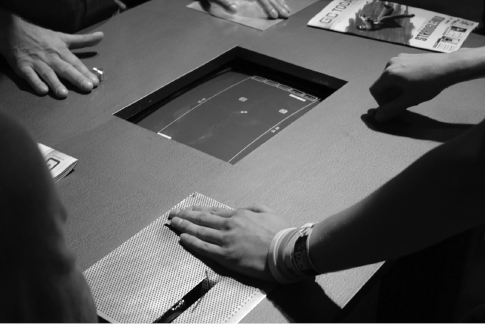

[Figure 3.9](#fig_009a) *PainStation* console, originally built in 2001, with the capacity to inflict wounds upon players.

*Source:* *PainStation*, Volker Morawe and Tilman Reiff (2006)

I’ll never forget the first time I saw *PainStation* in action. The game was part of an exhibition at a museum in San Francisco, where I was installing an art project I’d collaborated on (SimGallery).[25](#c3-note-25) During setup, artists and curators were trying out one another’s games before the show went live. I watched a round of *PainStation* between the exhibition curator and his assistant curator. It became clear to me that the assistant curator was subtly trying to lose the round, in order to avoid inflicting pain on her manager. The rest of us were watching intently, but also trying not to look too interested in what the outcome would be. We all wanted to maintain our own good relationships with the curation staff, and it was unclear how to spectate tactfully and appropriately. The possibility of physical harm completely altered the human dynamics surrounding the gameplay. It was a mesmerizing and horrifying demonstration of how physical stakes can radically shift the emotional and social tenor of the play experience.

## Moving Together: Designing Social Dynamics and Feelings

In chapter 2, I introduced research on the positive emotional effects of coordinated action.[26](#c3-note-26) Adding physical movement to the designer’s palette heightens the impact of player coordination, by layering in emotions that arise through physical feedback and emotional contagion, and also by orchestrating interpersonal distance and interactions between bodies. Researchers can tell a lot about relationships by looking at how closely people stand together, how they arrange themselves, and when and how they touch one another.[27](#c3-note-27) When designers use movement as a game mechanic, they can reengineer the normal ebb and flow of physical contact, the space between bodies, and the joint coordination of movement for dramatic effect. Movement that puts players’ bodies into new or unexpected physical configurations can trigger strong social and emotional experiences. Let’s look at ways designers have leveraged these factors in social gameplay situations ranging from pure competition, to blended “coopetition,” to pure cooperation.

### Pure Competition

In everyday adult life, we learn to keep a polite distance from one another and avoid aggressive contact. Competitive physical games in the digital space can flout these norms to great social and emotional effect. Independent developers have led the way in creating such games, perhaps because commercial developers perceive such social violation as too risky.

The canonical example of a movement game that encourages physical boundary breaking and frantic competition is *J. S. Joust*, created by Douglas Wilson and the Copenhagen Game Collective (see [figure 3.10a, b, c](#fig_010)). Winner of the Independent Game Festival’s Nuovo and Grand Prize awards in 2012, and many other awards, *Joust* uses the Move controller designed for the Sony PlayStation, but players look at each other, not at a screen. In this multiplayer game, two to seven people hold controllers and move about freely to music (Bach’s Brandenburg Concertos, which give the game its name), trying not to jar their controllers in the process. Tipping or jostling the controllers triggers a light and a loud sound, and the player has to leave the round. The controllers are a little more forgiving when the music is fast, which gives players a brief window to dash at one another. Gameplay can be quite genteel or very rough, depending upon what players are willing to do. Players can gang up on a single player, but in the end, only one player wins. Thus competition can be fierce. Wilson took his inspiration from folk games like egg-and-spoon races,[28](#c3-note-28) which offer a chance for friends and neighbors to challenge one another and work off energy and tensions in a playful way. And indeed, playing this game feels like an exhilarating and often hilarious combination of tag and an egg-and-spoon race.

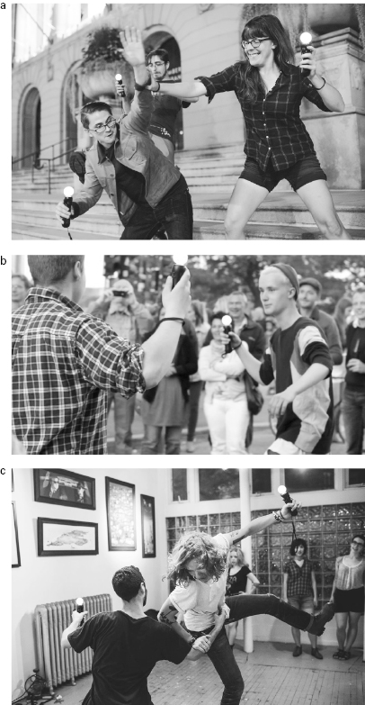

[Figure 3.10a, b, c](#fig_010a) *J. S. Joust* uses handheld movement controllers without a screen and encourages physical contact and frantic chases. For a look at *J. S. Joust* in action, see Johan Bichel Lindegaard, *Johann Sebastian Joust! at Amager Strandpar*k, Vimeo video, 1:09, June 4, 2011, <https://vimeo.com/24662278>.

*Source:* *Johann Sebastian Joust*, Brent Knepper/Sara Bobo/Die Gute Fabrik (2014)

Another game using physicality to heighten competition is the 2012 Indiecade finalist *Hit Me!*, by artist and game designer Kaho Abe (see [figure 3.11a, b](#fig_011)). Players wear helmets equipped with cameras, each with a button on top. Players try to push the button on top of each other’s helmets. If they succeed, the camera snaps a picture. A player gets extra points for appearing in the snapshot he or she triggers.

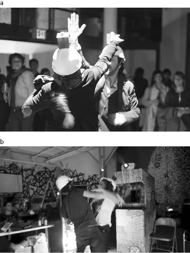

[Figure 3.11a, b](#fig_011a) *Hit Me!* requires players to press a button on top of one another’s heads to gain points. The game brings players into a combative stance they might normally never take toward another person in everyday life. To watch *Hit Me!* in action, see <https://vimeo.com/29638917>

*Source:* *Hit Me!* (Kaho Abe, 2011)

Spectators enjoy this strange and comical form of aggression almost as much as players: after all, in everyday life, we rarely see people trying to bop each other on the head. The designer, Abe, was the resident artist in my lab, and I had graduate students in one of my seminars play the game, which revealed rich and fascinating interpersonal dynamics. As it turned out, a student’s everyday demeanor did not reliably predict their reaction to being asked to (gently) whack another student on the head against their will. Nor did it predict how students would go about the task. One very polite student turned out to be a vigorous and feisty opponent, fearless in her leaping attempts to press other students’ buttons, and extremely comical in her body language. The funniest matchup was between this student and a male student who was trained in martial arts. He consistently defeated other men, but, when playing this particular student, found himself unable to be as hard-driving. All the matches produced fascinating social negotiations of space and contact. With its ridiculous helmets and awkward, silly motions encouraged by the rules, *Hit Me!* comes off as very comical, more *Three Stooges* than barroom brawl. Nevertheless, the game feels like a high-stakes endeavor. In trying to press your opponent’s button, you have to move deeply into their space and leap up in an odd, exposed sort of way. It feels wacky, awkward, and socially inappropriate. Abe has adeptly choreographed physical game mechanics to create this unique mix of feelings in players and spectators.

### “Coopetition”

Mixing competition with collaboration in a single game allows players to share positive emotion with their own team, and also enjoy the powerful buzz of group competition. This brand of social physical play will feel familiar to anyone who’s ever played a sport. Not surprisingly, in fact, movement game designers sometimes mimic sports themselves as they attempt to evoke the emotional and social work that sports accomplish for us. Senior Wii bowling leagues are a good example. *Wii Sports* bowling, distributed with the original Nintendo Wii platform, mimics most of the structure of “real” bowling, including the scoring system. Instead of rolling a real ball down an alley, players use the Wiimote to simulate this action. The game works well for seniors who can’t go out and bowl anymore for various reasons. Many players bowled in the past, so they’re comfortable with the game’s action, controls, and framework; senior Wii bowlers sometimes even extend bowling’s traditional social rituals, like team shirts and friendly trash-talking, to the virtual game. Senior Wii bowling leagues (such as the National Senior League[29](#c3-note-29)) use the Internet to allow teams to compete from a wide geographic area, without ever leaving their centers, which may be impractical or impossible for many of the players. The movement-based play enhances the pleasure and group feeling of the experience for the team members as they rack up scores to send off, and it also increases the excitement for local center spectators cheering them on.

The dance game *Yamove!* also draws on a real-world team-based physical activity, in this case, b-boy/b-girl-style dance battles. Dance battles originated in the 1970s along with rapping and scratching/mixing records, and still thrives today as a competitive form across the world.[30](#c3-note-30) Crews of dancers compete with each other, with individuals facing off in front of judges. *Yamove!* adapted and modified this format into a dance battle that takes place between *pairs* of players (see [figure 3.12a, b](#fig_012)). Inspired by the research linking physical coordination with emotional bonding and trust building,[31](#c3-note-31) the game requires players to improvise moves that showcase both partners’ dance skills: the goal is to move well *together*. Pairs, not individuals, receive scores, which reinforces the benefits of collaboration, while teams also experience the excitement of team competition in front of an audience. Each player wears a mobile device (phone or iPod) strapped to his or her forearm, and teams compete in three rounds. Dance pairs aim for high-intensity, in-sync, and diverse dance routines; the devices track movement data and assign scores. Adding to the excitement, a live MC (master of ceremonies, a term for the disc jockey who chooses, blends, and comments on music as he or she plays it) calls out feedback to the players so they know how they’re doing. Even though results also appear on a big screen, this is more for spectators than for players. Players are too busy keeping their eyes on each other to coordinate moves and stay in sync. *Yamove!* was a finalist at Indiecade 2012 and was also showcased at the 2012 World Science Festival.[32](#c3-note-32)

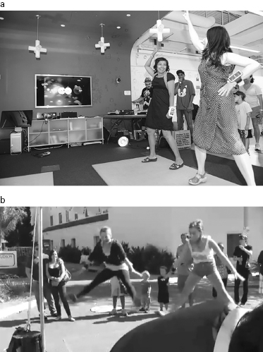

[Figure 3.12a, b](#fig_012a) *Yamove*, a dance-battle game that challenges pairs to move in synchrony. To see players in action, see <https://www.youtube.com/watch?v=N5igt1lX6Bg>.

*Source:* NYU Game Innovation Lab, *Yamove!* (2012)

Games like *Yamove!*, *Hit Me!*, and *JS Joust* all have something interesting in common—they avoid using a big screen to provide continuous and extensive feedback to players. Researchers have found that enhanced bonding and mutual good feeling more reliably arises from coordinated physical activity involving mutual gaze.[33](#c3-note-33) The more players look at each other, the better results they achieve in coordination and the stronger the lingering positive social effects. Thus the more attention players can put on each other’s movements, the more effectively the designer can use movement to evoke emotion and drive interesting social configurations and experiences. Indie games like the ones in this chapter use sound, tactile feedback, and human support, in roles such as the MC host, to break away from a reliance on a tight visual coupling of the player with the screen. I believe these kinds of tactics will become more common as our world grows increasingly saturated with sensors and alternate feedback systems beyond big screens.

### Pure Cooperation

Purely cooperative physical games ask players to meld their actions and intentions to achieve a common goal. Often these games reconfigure the arrangements of players’ bodies, dissolving the traditional spatial bubbles between people and among groups, provoking new emotions and connections.

*Bounden* (2014), for example, forces reconfiguration of the space between people. The game requires two players, but only one mobile device. Each placing a thumb on the screen, the players must move together to keep a virtual sphere visible and move it through a path of rings by tilting and rotating the device together. The result is (relatively) graceful synchronized movement that was in fact choreographed by the Dutch National Ballet (see [figure 3.13](#fig_013)). Using this very simple game task, *Bounden*’s designers lead players to move together, feel graceful together, and come closer together physically than they otherwise might, thereby evoking increased intimacy and trust.

[Figure 3.13](#fig_013a) *Bounden* is a two-player mobile-based game.

*Source:* *Bounden* (Game Oven, 2014)

*Ninja Shadow Warrior* also leverages physical closeness, encouraging as many people as possible to squeeze together. In this game, housed in a handcrafted arcade cabinet, players under attack in a virtual palace must hide using their “ninja powers” to transform into a vase, a tree, or some other ordinary object. They do so by shaping their bodies to fit a simple silhouetted shape (see [figure 3.14a, b, c](#fig_014)), displayed on the screen. Because several people can fill out a silhouette better than someone playing solo, the best scores come from group coordination. In this way, the game rewards close physical coordination simply by making it the most successful strategy. The game plays a little like the 1960s parlor game *Twister*, where players contort themselves in close contact with one another. *Ninja Shadow Warrior* pushes a playful form of physical intimacy upon players for a brief game cycle and posts it online in a photo stream. Not surprisingly, you see a lot of engaged and sometimes sheepish smiles on the Ninja Shadow Warrior Tumblr.[34](#c3-note-34)

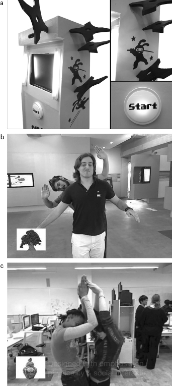

[Figure 3.14a, b, c](#fig_014a) *Ninja Shadow Warrior* has players try to form a shape’s silhouette without getting any body parts out of bounds.

*Source:* *Ninja Shadow Warrior* (Kaho Abe, 2011)

This sort of “the more the merrier” cooperative play design ([figure 3.15a, b](#fig_015)) also drives *Pixel Motion*, a game my lab created as part of a research project that looked at future uses of surveillance cameras. We wanted to explore the notion of surveillance cameras as a public utility: What if everyone had access to these cameras that surround us? What might we all do with that power? We worked on this project with researchers from Bell Labs who had developed motion flow software that identified overall movement patterns in video streams. The game was designed for a public museum space, at the Liberty Science Center in Jersey City, New Jersey. We wanted to create an experience that would actually mix strangers together in a common activity, to encourage them to forge connections and have more of a sense of community (most games and interactive experiences in museums have sensors that track only a handful of participants, so typically, one small group after another tries the activity, without much mingling among groups).

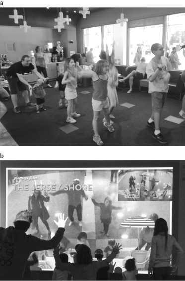

[Figure 3.15a, b](#fig_015a) *Pixel Motion* uses surveillance cameras and motion sensing to create physical collaboration among strangers.

*Source:* NYU Game Innovation Lab, *Pixel Motion* (2013)

In *Pixel Motion*, anyone in the camera’s field of view can join in “wiping” pixels off the video feed by moving around within the play space. Players have thirty seconds to wipe off enough pixels to win the round. A win means everyone gets to pose in a photo with on-screen props and share the resulting “postcard” via email or Twitter, creating a lasting memory of the game. The game’s leader board features postcard photos from high-scoring games.

The project team studied video and photo streams from the exhibit to understand the flow of groups as they engaged the game. We found that the design of *Pixel Motion* encouraged intergroup collaboration and blurred boundaries between clusters of museumgoers who normally wouldn’t mix much.[35](#c3-note-35) You can see this in the win-screen souvenir photos of victorious players, who tend not to recluster themselves into their own social groups (e.g., figure 3.15b, a souvenir snapshot of players from several visitor groups posing after a win). The game reconfigured the physical space within and around groups of people, mingling them together spatially and thus potentially breaking down social barriers between them as well.

## Body and Fantasy Identity

We’ve seen the emotional power that comes from mastery of a new physical skill, and the social and emotional power that comes from moving together with others. A third facet of body-based game design is the range of emotional transformations made possible by using the player’s body to cultivate fantasy identity.

As we saw in chapters 1 and 2, avatars act as our prosthetic bodies in gameplay, providing us a vehicle for enacting fantasy roles alone and with others. Adding movement to a game can strengthen a player’s identification with a character by leveraging physical enactment of the fantasy role of the avatar. For example, in *Star Wars: The Force Unleashed* (figure 3.4), players use physical movements to experience virtual power. They might pantomime picking up a heavy object and hurling it, while seeing an on-screen enemy flung through the air as a result. In this example, some of the emotion comes from the physical gesture itself, which signals strength and confidence, while some comes from the player’s fantasy identification with the Jedi knight onscreen. The game’s designers thus leverage signals from the player’s own body to heighten the feeling of “really” being a Jedi—physically enacting a fantasy role and receiving visceral feedback that corroborates the fantasy.

In *Star Wars: The Force Unleashed*, on-screen cues reinforce the fantasy persona, as the enemy’s body hurtles through the air, while digital images and sounds recreate the *Star Wars* universe. But in recent years, game designers have also been experimenting with techniques and technologies for augmenting physical fantasy gameplay *without* screens and consoles. These games come in various subgenre flavors, including live action role-playing games (LARP), pervasive games, and augmented reality games.[36](#c3-note-36) LARPers physically enact fantasy situations together in real-world settings, typically with costumes and faux weapons. A precursor genre to modern digital role-playing games, LARP continues to be a thriving practice today in its own right (see, e.g., <http://knutepunkt.org>, the website for the annual Nordic LARP conference). Pervasive games also occur in real-world settings, with players moving across multiple locations as they play, while augmented reality games use technologies to reveal hidden information embedded in everyday objects chosen as game props; for example, players might hold a device over an object to read a hidden digital message. All three game communities have been at the vanguard of incorporating technology in ways that enhance the player/character’s sensory and imaginative immersion in a fantasy game world.

For example, [figure 3.16a, b](#fig_016) shows a technology-enhanced glove, “the Thumin,” created for an augmented reality game called *Momentum.* The Thumin allowed the player to look for hidden sources of magic. Rigged to identify RFID tags hidden in the landscape, the glove vibrated when stroked slowly over a surface where a tag, symbolizing “sources of mage,” could be found. As the designers explain: “The act of stroking the physical surface of, e.g. a tree, while wearing a glove is authentic, even though the act invokes virtual content associated to the RFID tag. The act is focused on the tree rather than on the glove or the virtual content, and this is emphasized by the tangible feedback.”[37](#c3-note-37) The deep integration of the device’s form factor and sensory augmentations into the story world helps to transport players more wholly into the game and enhance the enactment of their game identities.

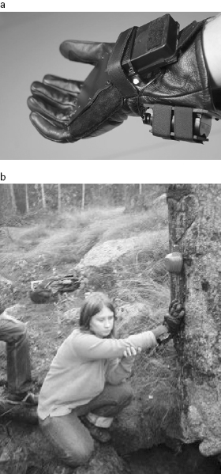

[Figure 3.16a, b](#fig_016a) The Thumin glove used RFID and vibrator technology to allow players of an alternate reality game to search for “magic” objects.

*Source:* *Momentum* (The Interactive Institute, 2009)

Wearables like the Thumin can also heighten players’ social fantasy experience of a game. [Figure 3.17a, b](#fig_017) shows a gauntlet and backpack designed for a social movement-based game called *Hotaru* designed by Kaho Abe, my lab’s artist in residence. This game explores the potential of costumes to be social game controllers.[38](#c3-note-38)

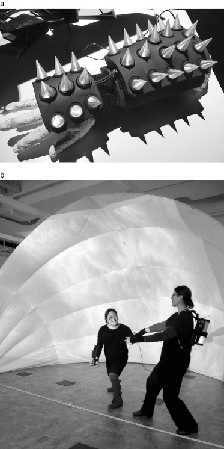

[Figure 3.17a, b](#fig_017a)

*Hotaru* combines wearable technology and gameplay, to immerse players in fantasy personas. *Source:* *Hotaru: The Lightning Bug Game* (Kaho Abe, 2015)

To play *Hotaru*, two players put on technology-enhanced costume elements—one wears a gauntlet and the other an energy tank (see figure 3.17). The players have complementary roles in the game; the player with the tank collects energy, and the player with the gauntlet releases the energy to battle an enemy. The two must hold hands to transfer the power between them. Inspired by the costume-based transformations from superhero shows like Kamen Riders,[39](#c3-note-39) in which gestures activate wearable technology to transform a person into a superhero, Abe designed *Hotaru* to draw on action poses and gestures. The players’ coordinated movements, monitored and recorded by the costumes, leverage the physical feedback loop described earlier in this chapter. The game also incites emotional contagion, creating emotional responses and immersion among players and spectators. The costumes add to the sensory realism of the fantasy experience; the social game mechanics force interdependence; and the physical contact that happens when players hold hands to transfer energy heightens feelings of interconnection and intimacy. In many ways, *Hotaru* embodies most of the concepts discussed in this chapter and illuminates new possibilities for games in the future.

## Wrapping Up

Our bodies dramatically shape our emotional experience. This is as true in gameplay as in real life. Thanks to the rise of movement-based game controllers and wearables, game designers can now use players’ bodies themselves as a medium for shaping emotions and social connection. Through strategies requiring players to master fatigue or pain, to position their bodies in ways that evoke closeness and camaraderie, by challenging comfort zones and merging technology, reality and fantasy, game designers are innovating an ever richer emotional palette. Rather than immobilizing and devaluing the body, or isolating players from other people, games in the future have the potential to embrace and enhance the role of the body and movement in play. They may recouple the physical and emotional, gracefully augment and transform our social interactions, and support our performance of who we are, or who we want to be.

To be sure, it’s also possible that these developments could lead in a different direction, further problematizing and fragmenting our understanding of what it means to be present with one another. Who is the real me and how do I interact? Who am I without my wearable augmentation and who am I to you if we are not engaging through technologically augmented role-play? While these seem like new concerns, our society already confronts these questions every day, over more prosaic “technologies” such as makeup and clothing, as well as in the use of social media to manage social identity. Adding a layer of environmental responsiveness, and the dynamics of interpersonal interaction with and through augmentation technologies, will continue to challenge our ability to sort out all of these very human concerns.

## Notes

[1.](#c3-note-1a) Roni Caryn Rabin, “The Hazards of the Couch,” *New York Times*, January 12, 2011, <http://well.blogs.nytimes.com/2011/01/12/the-hazards-of-the-couch/> (accessed August 26, 2015).
[2.](#c3-note-2a) Katherine Isbister, “Emotion and Motion: Games as Inspiration for Shaping the Future of Interface,” *Interactions* 18, no. 5 (September–October 2011): 24.
[3.](#c3-note-3a) Katherine Isbister and Floyd ‘Florian’ Mueller, “Guidelines for the Design of Movement-Based Games and Their Relevance to HCI,” *Human Computer Interaction* 30 (no. 3–4, 2015): 366–399; Elena Márquez Segura and Katherine Isbister, “Enabling Co-located Physical Social Play: A Framework for Design and Evaluation,” in *Game User Experience Evaluation*, ed. Regina Bernhaupt (New York: Springer, 2015); Holly Robbins and Katherine Isbister, “Pixel Motion: A Surveillance Camera Enabled Public Digital Game,” Katherine Isbister, “How to Stop Being a Buzzkill: Designing Yamove!, A Mobile Tech Mash-Up to Truly Augment Social Play,” *MobileHCI ’12 Proceedings of the 14th International Conference on Human–Computer Interaction with Mobile Devices and Services* (New York: ACM, 2012): 1–4; Isbister, “Emotion and Motion”; Katherine Isbister, Ulf Schwekendiek, and Jonathan Frye, “Wriggle: An Exploration of Emotional and Social Effects of Movement,” *CHI ’11 Extended Abstracts on Human Factors in Computing Systems* (New York: ACM, 2011), 1885–1890.
[4.](#c3-note-4a) Fritz Strack, Leonard L. Martin, and Sabine Stepper, “Inhibiting and Facilitating Conditions of the Human Smile: A Nonobtrusive Test of the Facial Feedback Hypothesis,” *Journal of Personality and Social Psychology* 54, no. 5 (1988): 768.
[5.](#c3-note-5a) Dana R. Carney, Amy J. C. Cuddy, and Andy J. Yap, “Power Posing: Brief Nonverbal Displays Affect Neuroendrocrine Levels and Risk Tolerance,” *Psychological Science* 21, no. 10 (2010): 1363.
[6.](#c3-note-6a) Katherine Isbister, Rahul Rao, Ulf Schwekendiek, Elizabeth Hayward, and Jessamyn Lidasan, “Is More Movement Better? A Controlled Comparison of Movement-Based Games,” *FDG ’11 Proceedings of the 6th International Conference on Foundations of Digital Games 2011* (New York: ACM, 2011): 331.
[7.](#c3-note-7a) Nadia Bianchi-Berthouze, Whan Woong Kim, and Darshak Patel, “Does Body Movement Engage You More in Digital Game Play? And Why?,” *ACII ’07 Proceedings of the 2nd International Conference on Affective Computing and Intelligent Interaction* (Heidelberg: Springer-Verlag, 2007): 102; Siân E. Lindley, James Le Couteur, and Nadia Bianchi-Berthouze, “Stirring Up Experience through Movement in Game Play: Effects on Engagement and Social Behavior,” *CHI ’08 Proceedings of the SIGCHI Conference on Human Factors in Computing Systems* (New York: ACM, 2008): 511; Isbister, Schwekendiek, and Frye, “Wriggle,” 1885.
[8.](#c3-note-8a) Katherine Isbister and Christopher DiMauro, “Waggling the Form Baton: Analyzing Body-Movement-Based Design Patterns in Nintendo Wii Games, Toward Innovation of New Possibilities for Social and Emotional Experience in Whole Body Interaction,” in *Whole Body Interaction*, ed. David England (London: Springer-Verlag, 2011), 63; Katherine Isbister, Michael Karlesky, and Jonathan Frye, “Scoop! Using Movement to Reduce Math Anxiety and Affect Confidence,” *CHI ’12 Proceedings of the SIGCHI Conference on Human Factors in Computing Systems* (New York: ACM, 2012): 1075.
[9.](#c3-note-9a) Elaine Hatfield, E., John T. Cacioppo, and Richard L. Rapson, *Emotional Contagion* (Cambridge, UK, and New York: Cambridge University Press, 1994).
[10.](#c3-note-10a) Tom F. Price, Carly K. Peterson, and Eddie Harmon-Jones, “The Emotive Neuroscience of Embodiment,” *Motivation and Emotion* 36, no. 1 (2012): 36, doi:10.1007/s11031-011-9258-1.
[11.](#c3-note-11a) David A. Havas, Arthur M. Glenberg, Karol A. Gutowski, Mark J. Lucarelli, and Richard J. Davidson, “Cosmetic Use of Botulinum Toxin-A Affects Processing of Emotional Language,” *Psychological Science* 21, no. 7 (July 2010): 895–900.
[12.](#c3-note-12a) Dean Tate and Matt Boch, “Break It Down! How Harmonix and Kinect Taught the World to Dance; The Design Process and Philosophy of *Dance Central*,” Game Developers Conference 2011, <http://www.gdcvault.com/play/1014487/Break-It-Down-How-Harmonix> (accessed August 26, 2015).
[13.](#c3-note-13a) Gina Kolata, “Yes, Running Can Make You High,” *New York Times*, March 27, 2008, <http://www.nytimes.com/2008/03/27/health/nutrition/27best.html> (accessed August 26, 2015).
[14.](#c3-note-14a) Florian “Floyd” Mueller, Frank Vetere, Martin R. Gibbs, Darren Edge, Stefan Agamanolis, Jennifer G. Sheridan, and Jeffrey Heer, “Balancing Exertion Experiences,” *CHI ’12 Proceedings of the SIGCHI Conference on Human Factors in Computing Systems* (New York: ACM, 2012); Isbister and Mueller, “Guidelines for the Design of Movement-Based Games and Their Relevance to HCI.”
[15.](#c3-note-15a) Sm00t, “I Lost 70 Pounds Entirely Playing Dance Dance Revolution and Have since Gained 25 Pounds of Muscle and Growing,” */r/IAmA Reddit Driven Q&A*, July 8, 2012, <http://www.topiama.com/r/106/i-lost-70-pounds-entirely-playing-dance-dance> (accessed August 26, 2015); Associated Press, “Video Game Fans Dance Off Extra Pounds,” *DNITech*, May 24, 2004, <http://www.dnitech.com/danceoffthepounds.htm> (accessed August 26, 2015).
[16.](#c3-note-16a) Alexander Sliwinski, “West Virginia University Study Says DDR Helps Fitness Attitude,” *Joystiq*, December 21, 2006, <http://www.engadget.com/2006/12/21/west-virginia-university-study-says-ddr-helps-fitness-attitude/> (accessed August 26, 2015).
[17.](#c3-note-17a) <http://www.immersence.com/osmose/> (accessed August 26, 2015).
[18.](#c3-note-18a) Joe Donnelly, “Experiencing ‘Deep’, the Virtual Reality Game That Relieves Anxiety Attacks,” *Vice* (2015). <http://www.vice.com/en_uk/read/experiencing-deep-the-virtual-reality-game-that-relieves-anxiety-attacks-142> (accessed August 26, 2015).
[19.](#c3-note-19a) Simon Parkin, “Desert Bus: The Very Worst Video Game Ever Created,” *The New Yorker*, July 9, 2013, <http://www.newyorker.com/tech/elements/desert-bus-the-very-worst-video-game-ever-created> (accessed August 26, 2015).
[20.](#c3-note-20a) Ibid.
[21.](#c3-note-21a) Ibid.
[22.](#c3-note-22a) <http://www.pippinbarr.com/games/dmai/> (accessed August 26, 2015).
[23.](#c3-note-23a) See <http://eddostern.com/works/tekken-torture-tournament/> (acces­sed August 26, 2015).
[24.](#c3-note-24a) *Pong* is an early computer game that simulates paddle tennis.
[25.](#c3-note-25a) See Simgallery.net.
[26.](#c3-note-26a) Kerry L. Marsh, Michael J. Richardson, and R. C. Schmidt, “Social Connection through Joint Action and Interpersonal Coordination,” *Topics in Cognitive Science* 1, no. 2 (2009): 320, doi:10.1111/j.1756-8765.2009.01022.x; Pierecarlo Valdesolo and David DeSteno, “Synchrony and the Social Tuning of Compassion,” *Emotion* 11, no. 2 (2011): 262, doi: 10.1037/a0021302; Pierecarlo Valdesolo, Jennifer Ouyang, and David DeSteno, “The Rhythm of Joint Action: Synchrony Promotes Cooperative Ability,” *Journal of Experimental Social Psychology* 46, no. 4 (2010): 693, doi:10.1016/j.jesp.2010.03.004.
[27.](#c3-note-27a) Edward T. Hall, “Proxemics,” *Current Anthropology* 9, no. 2–3 (1968): 83; Mark L. Knapp and Judith A. Hall, *Nonverbal Communication in Human Interaction*, 3rd ed. (New York: Holt, Rinehart & Winston, 2002).
[28.](#c3-note-28a) Douglas Wilson, “Designing for the Pleasures of Disputation—or—How to make friends by trying to kick them!,” Ph.D. dissertation, IT University of Copenhagen, 2012, <http://doougle.net/phd/Designing_for_the_Pleasures_of_Disputation.pdf> (accessed August 26, 2015).
[29.](#c3-note-29a) See <http://www.nslgames.com> (accessed August 26, 2015).
[30.](#c3-note-30a) Christopher Cole Gorney, “Hip Hop Dance: Performance, Style and Competition,” MFA thesis, 1977, Department of Dance, University of Oregon.
[31.](#c3-note-31a) Kerry L. Marsh, Michael J. Richardson, and R. C. Schmidt, “Social Connection through Joint Action and Interpersonal Coordination,” *Topics in Cognitive Science* 1, no. 2 (2009): 320, doi:10.1111/j.1756-8765.2009.01022.x; Pierecarlo Valdesolo and David DeSteno, “Synchrony and the Social Tuning of Compassion,” *Emotion* 11, no. 2 (2011): 262, doi: 10.1037/a0021302; Pierecarlo Valdesolo, Jennifer Ouyang, and David DeSteno, “The Rhythm of Joint Action: Synchrony Promotes Cooperative Ability,” *Journal of Experimental Social Psychology* 46, no. 4 (2010): 693, doi:10.1016/j.jesp.2010.03.004.
[32.](#c3-note-32a) Isbister, “How to Stop Being a Buzzkill,” 1.
[33.](#c3-note-33a) Pierecarlo Valdesolo and David DeSteno, “Synchrony and the social tuning of compassion,” *Emotion* 11, no. 2 (2011): 262, doi: 10.1037/a0021302; Pierecarlo Valdesolo, Jennifer Ouyang, and David DeSteno, “The Rhythm of Joint Action: Synchrony Promotes Cooperative Ability,” *Journal of Experimental Social Psychology* 46, no. 4 (2010): 693, doi:10.1016/j.jesp.2010.03.004.
[34.](#c3-note-34a) See <http://ninjashadowwarrior.tumblr.com> (accessed August 26, 2015).
[35.](#c3-note-35a) Holly Robbins and Katherine Isbister, “Pixel Motion: A Surveillance Camera Enabled Public Digital Game,” *Proceedings of Foundations of Digital Games 2014*, Fort Lauderdale, FL (2014), <http://www.fdg2014.org/proceedings.html> (accessed August 26, 2015).
[36.](#c3-note-36a) Annika Waern, Markus Montola, and Jaakko Stenros, “The Three-Sixty Illusion: Designing for Immersion in Pervasive Games,” *CHI ’09 Proceedings of the SIGCHI Conference on Human Factors in Computing Systems* (New York: ACM, 2009): 1549, doi:10.1145/1518701.1518939.
[37.](#c3-note-37a) Ibid.
[38.](#c3-note-38a) Jason Johnson, “Are Costumes the New Game Controllers?,” *Kill Screen*, July 12, 2013, <http://killscreendaily.com/articles/are-costumes-new-game-controllers/> (accessed August 26, 2015)[;](http://;)Katherine Isbister and Kaho Abe, “Costumes as Game Controllers: An Exploration of Wearables to Suit Social Play,” paper presented at the 9th International Conference on Tangible, Embedded and Embodied Interaction, Stanford, CA (2015).
[39.](#c3-note-39a) <https://www.youtube.com/watch?v=T3zGRmVES0w> (accessed Aug­ust 26, 2015).

