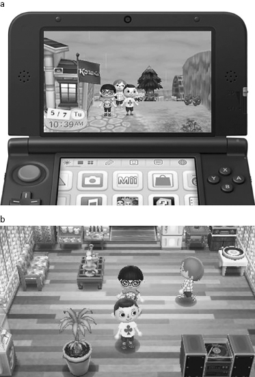
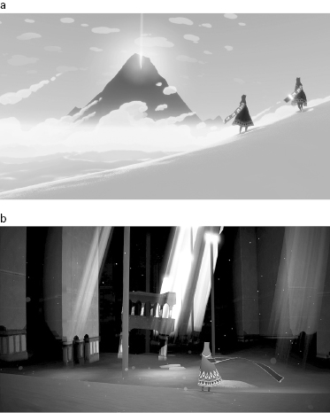
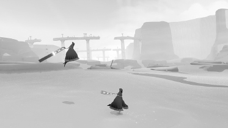

# 4 Bridging Distance to Create Intimacy and Connection

# 4 Bridging Distance to Create Intimacy and Connection

When players in a room together laugh, jump, and tease each other, the power of games to drive connection, empathy, and closeness appears right before your eyes. Yet these days, some of the most memorable moments for players, times of quiet intimacy and deep friendship, happen without the in-person cues we usually rely on to build and convey emotional connection. An observer might never sense the emotional weight of these experiences that occur through networked gaming.

Ubiquitous connection has dramatically changed how we communicate with one another on a day-to-day basis, shaping how we understand community and copresence.[1](#c4-note-1) Texting, Twitter and Facebook, email, and blogs offer countless ways to check in on someone—or many someones. Game developers have interwoven networked communication and the sense of copresence it creates deep in the experiences that they offer players today. Though the media frequently cover changes in communication and social norms due to social media, they seem to rarely discuss or allow for the feelings and social interactions made possible by networked games. Game designers combine the building blocks of emotional connection described in chapter 2—coordinated action, avatar-based role-play—with the power of network connections to create a wide range of emotionally meaningful social experiences for players who are geographically distant from one another. In this chapter, I’ll cover three examples of tactics game designers use: the sharing and exchanging of digital objects, the cultivation of “summer camp”–like contexts for play, and the shaping of hobbyist and activist communities around play.

## A Note in Your Lunchbox

Human beings show and cultivate closeness with others through small everyday actions: putting a note or an extra treat in a child’s lunchbox, leaving a sack of tomatoes from the garden on a neighbor’s porch, setting out an item where it won’t be forgotten in the morning for your partner, feeding the cat for a friend. Gift giving and favors are part of the social glue that holds us together and strengthens our connections with one another.[2](#c4-note-2) We also engage in other sorts of ongoing nonconversational exchanges that reveal who we are and how we feel about each other: playing a chess game by mail; keeping track of an old school friend through the extended social network, mass holiday letters, Facebook, and Google, punctuated by brief interactions at the occasional class reunion. These aren’t conversation but they nevertheless strengthen the social fabric.

Digital games enhanced with network access can provide these sorts of social exchanges as part of the play experience. Consider, for example, *Words with Friends* (*WWF*) (see [figure 4.1](#fig_001)). This Scrabble-like game allows two people to compete for points as they fill a board with words. You can play with a friend in whatever turn rhythm works for each of you—you make a move, then when they make a move the app will let you know. There’s no need to talk (though chat is an available feature) to see how things are going. The kinds of words you play and their values are a form of communication, as is the rhythm of play itself. Researcher Amy Bruckman reflected on the real-world impact of social connection through *Words with Friends*, explaining how Facebook matched her up for a game with her old high school friend Mike, whom she hadn’t seen since the 1980s.

[Figure 4.1](#fig_001a) *Words with Friends* is a Scrabble-like game that can be played on a smartphone.

*Source:* *Words with Friends* (Zynga, 2015); screenshot courtesy of Luke Stark

> It felt great to reconnect with an old friend. . . . I would be inclined to dismiss the sense of connection as an illusion, except for one thing: Mike mentioned that next time I’m in New York I should look him up—we’ll get coffee. The likelihood that I’ll take him up on that invitation is fairly high. Before we played WWF, it wouldn’t’ve crossed my mind. The chance of meeting up in person has gone from near zero to moderately high–a difference of multiple orders of magnitude. The real re-connection will take place in person. But it wouldn’t have happened without the online connection.[3](#c4-note-3)

Games like *WWF* allow people to engage in a slow form of coexperience with enough expressive range to allow them to reveal themselves through their moves. Players enjoy weaving these interactions into the daily rhythm of computer and mobile phone use, which is generally more task-oriented. It’s a lightweight way of keeping in touch, interwoven with existing social networking software that players might be using anyway—for example, *WWF* can be played through Facebook as well as on a mobile device as a standalone app. For a few moments here and there, these games can offer the feeling of sitting with a friend to play a hand of cards. They may not be enough to forge or sustain a tie on their own, but they do offer an access point and a kind of shared experience that can help strengthen a tie over time. Players express things about themselves as they strive to win, and competition provides spice as well as a frame for interaction.

Digital games with immersive fantasy worlds provide designers with additional tools for creating connection between players. In games where players need to acquire resources, equipment, and powers, for instance, gifting and sharing serve important social roles. For example, MMORPGs (massively multiplayer online role-playing games), like *City of Heroes,* discussed in chapter 2, allow players to give items to each other. These gifts may have practical value in the game, but they also express the gift giver’s relationship to the recipient, and their own character, through what they give and when. Consider this post by a mother who plays *World of Warcraft* with her daughter:

> Would you call me a bad person if I confessed I couldn’t actually recall the best gift I’ve ever been given in game? It was actually a whole set of items, though, and there’s a reason I can’t remember them either singly or as a unit. They’re the quirky, humble gray and white items my daughter would wrap up and send me for the sheer delight of it when she first started playing confidently on her own. I have a whole row of these mementos in somebody or other’s bank vault—flowers, low-level dresses, and odd gray drops that tickled her fancy when she came across them. I would know she had discovered something she loved when she would forbid me to walk behind her when she was at the keyboard, and I could clearly see that she was in town. She wrapped each gift with care, usually sending it along with a vendor-bought sweet treat if she had enough silver. None of these gifts were remarkable in and of themselves, but they were all so full of her joy of discovery and anticipation of sharing that nothing else I’ve ever been given can ever match them.[4](#c4-note-4)

Another example of the power of gifts comes from a game reporter given a preview of another acquisition-focused game, *Animal Crossing: New Leaf* (see [figure 4.2a, b](#fig_002)). In this game, the player visits with NPC townspeople and earns “bells” toward building out a home and its contents, as well as cultivating the general well-being of the town itself. Totilo received a tour of the game from co-creator Aya Kyogoku, in which he visited her town within the game:

[Figure 4.2a, b](#fig_002a) *Animal Crossing: New Leaf* is a game played on the Nintendo DS3 handheld console. The player homesteads in a town where she can become mayor, interacting with inhabitant NPCs as well as other human players who can visit her town using network capabilities.

*Source:* *Animal Crossing: New Leaf* (Nintendo, 2012); screenshot courtesy of Kotaku (2013)

> Kyogoku directed me to some objects outside the train station. They were at my feet. “I left you some gifts,” she said. There were baskets of fruit. There was a present wrapped in special wrapping paper. She encouraged me to open the gift. It contained carp streamers, a gift that only Japanese gamers were slated to receive from the game on Children’s Day in early May. I’d never have unlocked it in my American copy of the game. . . . This wasn’t a mere tour, obviously, it was a friendly sales pitch—with gifts. We all casually walked past a flag that just happened to have a *Kotaku* logo on it. Flattery! Later, they sent me a QR code to generate it.[5](#c4-note-5)

In this situation, the game’s creators were using the emotional power of gifts to try to give the journalist a warmer feeling about the game. Later in the interview, Kyogoku invites him into her in-game ‘home.’ In writing about it, Totilo captures nicely the odd power of sharing in-game, and how it leaks into one’s feelings:

> We headed over to Kyogoku’s primary home. She went inside. Eguchi stood by the mailbox. Just . . . go in? Yes, they told me. This was weird, maybe because I’m a mere *Animal Crossing* dabbler, maybe because this felt weirdly intimate. It felt different than hanging out outside in the virtual rain. Yes, we were playing a game. They were clearly trying to hype its features and generate a positive story. But I suddenly felt like I was imposing. Homes are private places. Walking into another person’s—particularly that of a person who made the game—felt like a big step. Of course this wasn’t really a home. I was just buying into the metaphor more strongly than I’d expected.

The charm of *Animal Crossing: New Leaf* is its combination of slow, thoughtful play in a magical little world, where you are usually alone but once in a while pass time with other players. Each day is different. The seasons change; the sun rises and sets, and the stars come out at night. In winter you may log onto the game and find it has snowed. NPC creatures and characters greet you and share the latest news. As one player puts it:

> This is the crux of *Animal Crossing: New Leaf*’s genius. Rather than a game you may play intensely for a time and then finish, it is a much longer, slow unfolding experience. It draws you in day by day, until the first thing you do each morning is go and check on the prices of different fruit and see what your virtual friends have been up to. It’s the closest thing I’ve come to a daily videogame meditation, at times it almost feels therapeutic—or maybe some strange experiment being carried out on the human race by Nintendo.[6](#c4-note-6)

The player’s job in the game is to collect things as flora and fauna change with the seasons. Occasionally, you might invite others into the world and share its magic, just as you might bring a friend to a favorite spot in the country where you spent hours playing as a child. This kind of sharing is quite different from posting status updates and snapshots on social media, because it takes place within the context of the “magic circle” of gameplay. The magic circle is a term coined by Dutch historian and cultural theorist Johan Huizinga in the 1930s—a cocreated safe and bounded context in which players can comingle fantasy and reality, and which thus allows for freer and more flexible social connection and emotional expression.[7](#c4-note-7) To be invited into another player’s own in-game home, and given a gift, provokes strong emotion, but also carries with it the safety of the magic circle of play, a charming and powerful combination.

## Camp a Click Away

In chapter 2, we looked at social situations game designers craft for players, meant to cause certain kinds of social and emotional effects. For example, the game *Keep Me Occupied* was designed to heighten esprit de corps among activists at an Occupy camp in Oakland. The game’s arcade machine, built to fit into a novel rearrangement of people in real time and space, emphasized their collective spirit and power. Networked game designers conjure virtual settings that feel like supercharged real-world places and use them to generate camaraderie among far-flung players. Stories of play in massively multiplayer online worlds can sound remarkably like anecdotes from mass gatherings in real life (albeit with fantastical elements). For example, in academic researcher Celia Pearce’s account of her ethnographic work in an MMO called *There.com*, she describes a moment when players are engaged in a chaotic game, driving brightly colored buggies and chasing a ball, which she is trying to document for her research.

> It’s a little difficult to see in the midst of the buggy melee that is the playing field. So I hop off the buggy and don my hoverpack. I flit about in the air and take a load of pictures of the proceedings. The field is total bedlam. You can hear from the voice chat that group members are having a huge amount of fun.[8](#c4-note-8)

From her vantage point above the game, Pearce realizes that the ball has lodged itself high in a tree, and that her avatar, Artemesia, can get to it. As other players shout encouragement, she tries to knock the ball from the tree—and then finds herself sucked inside it.

> At this point I stop taking pictures because I am too caught up in the moment (one of the hazards of playing and doing research at the same time), but I realized very quickly that the orb is driveable, so I use my arrow keys to roll it out of the tree back onto the playing field. With lots of shouting from the group, I find my way to the center of the field, position myself, take my hands off the arrow keys, and prepare myself for an all-out assault. It is in this way that I become the ball for the remainder of the Buggy Polo game.[9](#c4-note-9)

Pearce marks this moment as a turning point in her research, when she went from primarily observing to also engaging and actively participating. Transforming from an observer to an active and joyful participant might be familiar to anyone who ever went to summer camp. The camp experience works because of the setting and the activities that campers engage in together, which form a context for learning about oneself and bonding with others. Traditionally summer camps were set up in the wilderness, where campers would need to be more self-reliant in meeting everyday needs, and would explore a sometimes challenging environment together. The camp experience intentionally pushes campers out of their comfort zone, to engage them in mastery of new physical skills in the company of others, toward lifelong benefits.[10](#c4-note-10)

Game designers create a summer camp–like feeling for players through a combination of carefully wrought virtual worlds, game actions, and well-crafted avatars. Networked games allow players to explore unfamiliar and challenging terrain and to share their experience with other players. This shared online experience does the same kind of work as summer camp, encouraging personal growth in players and deepening their connections to one another. Game designers don’t get enough credit for their skill in designing supportive environments for emotional and social growth.

The highly lauded indie game *Journey* ([figure 4.3a, b](#fig_003)) offers an elegant, pared-down example of the intentional design of collaborative exploration and discovery. Released in 2012, *Journey* won a wide array of game industry honors, including multiple BAFTA and Game Developers Choice awards. *Journey* was developed for the Sony PlayStation 3. As its name suggests, the game offers a journey through beautiful and challenging terrain, with a simple control scheme and set of player actions focused on traversing the landscape. *Journey*’s lead designer, Jenova Chen, says he wanted to give players a “sense of small,” like astronauts walking on the moon. Most games, he says, try to make players feel powerful by giving them magic, guns, and superpowers. Instead, Chen wanted players to experience awe at the game’s majestic landscapes.[11](#c4-note-11)

[Figure 4.3a, b](#fig_003a) *Journey* was designed to emphasize players’ smallness in an awe-inspiring environment. Players engage in wordless collaboration to explore the game’s terrain.

*Source:* *Journey* (thatgamecompany, 2012); *Journey* courtesy of Sony Computer Entertainment America LLC

The design choices in *Journey* all further this vision. The avatar in *Journey* is a small, simply robed figure, with a long flowing scarf (see [figure 4.4](#fig_004)). Unlike some of the games covered in chapter 1, *Journey* doesn’t give players any choice in individualizing the avatar, although as players advance through the game, some subtle marks of experience appear on their avatars’ cloaks. The diminutive avatar appears silhouetted against magnificent and sparse landscapes, all of which helps make the player feel tiny and insubstantial. The charm of operating the avatar lies in the magic of moving through the game landscape, and the fine-tuned responsiveness of both the avatar and the game world to the player’s actions. Game reviewer Erik Kain says: “Even just sliding and floating down a huge corridor of flowing sand is a breathtaking experience, and being *in control* of how you make that descent causes it to be not merely a visual feast or something to observe, but something that is *actively fun to do*.”[12](#c4-note-12) Another reviewer says: “You have to press the X button for yourself and feel what it’s like for your robed avatar to leave the desert floor and drift back down like a fallen leaf surfing a breeze. To play *Journey* is to savor the most incredible inner lightness. . . . To play *Journey* is to feel like a soul freed of its corporeal baggage.”[13](#c4-note-13) This reviewer links the feeling of jumping in *Journey* to childhood fantasies of moonwalking:

[Figure 4.4](#fig_004a) Player characters jumping in *Journey*.

*Source:* *Journey* (thatgamecompany, 2012); *Journey* courtesy of Sony Computer Entertainment America LLC

> Kids don’t dream of being astronauts in hopes of conducting tests on mice aboard cramped space stations; they simply want to pogo around on the moon. One giant leap, indeed. Followed by another, and another. Since most kids never get to realise this fantasy, we give them inflatable Moonwalks at birthday parties and backyard trampolines to soften the blow. And of course we give them videogames.[14](#c4-note-14)

*Journey*’s enchanting gameplay and emotional appeal, enhanced by an evocative musical score, seem naturally suited to meditative, solitary play. But its designers also pushed the boundaries of the multiplayer experience. Players can’t do all the game’s activities or see all its wonders unless they sometimes travel with others. Each player periodically finds another player in the landscape who has been randomly paired with them over the network. The designers chose a minimalist approach to crafting the communication possibilities between players; avatars can only make a sort of chiming/chirping sound. They need to pay close attention to each other and experiment with their actions to discover how to work together in the game. The wordless collaboration that takes place made for a powerful experience for one player:

> This *reliance* on one another that’s programmed into the game is what makes it so captivating. As I began to climb the final slopes and the wind and the dragons became more dire and my own situation more desperate, I found myself and this other anonymous person clinging to one another as we moved up the slope. When I was tossed aside by a dragon, left lying half-broken in the snow, the other traveler ran back for me. We climbed together. At this point, the idea of climbing alone had vanished from my thoughts entirely even though so often in games the solo route is the one I take. In a way that no other multiplayer game has done, I felt the *necessity* of companionship in *Journey*. In literally no MMO I’ve ever played have I felt that need, but in *Journey* that sense of struggle feeds directly into a sense of camaraderie. It’s deeply affecting.[15](#c4-note-15)

*Journey*’s designers use avatar visual design and physical responsiveness, vast and majestic landscapes and soundscapes, and powerful minimalist tools for coordinated action and communication to create a dramatic and transformative experience for players. Emotionally, playing the game evokes the sort of feelings that come up when sharing a challenging but temporary real-world adventure with someone, like a river rafting trip or summer camp outing. If you haven’t played a networked game like this one, you should not underestimate how pleasant and “real” these experiences can be.

## Collective Play as Community Builder

*Journey*’s potent, stripped-down interdependence points to larger opportunities for game designers in networked multiplayer situations. Anytime players gather and take part in something that has a persistent alternate world, the stuff of their interaction can be shaped to create a positive experience. Players of games have always thrown their lot together to get further along, and also to enjoy the mutual pleasure of ruminating over and solving things among peers. With computers and the Internet, it’s possible to make this happen at a mass scale.

Multiplayer networked games played in real time often require elaborate plans and communication among players through voice-based or text-based chat as players form raiding parties, launch attacks, and coordinate other in-game business. Massively multiplayer games bring hundreds of players together in much larger organized bodies such as guilds or factions that persist over months and years, developing their own social norms and lore. Designers have realized that extended play is far more meaningful when embedded in understandable human social frameworks for collective action.[16](#c4-note-16)

Players and scholars have written many perceptive pieces about the strong social and emotional ties formed by long-term play in persistent game worlds.[17](#c4-note-17) But few have explored the community-building capabilities of another kind of networked game—asynchronous mass play (players engaging in the same game at different times)—in games like *Words with Friends*. Spelling a word might be a solitary act, but players learn from each other’s moves, enjoying the unique pleasure of tracing another person’s thought process. In everyday life, we learn from observing one another, picking up nuances of practice so that we don’t have to entirely reinvent the wheel each time we take up a new task.[18](#c4-note-18) Games at a mass scale allow us to observe one another’s strategies and to create a community of expertise much as communities form around hobbies. With fishing, say, anglers enjoy solo trips, but they also enjoy planning trips with friends and strategizing with others, telling stories about their trips, and learning from each other’s experiences. One of the deep pleasures of a hobby is the growth and strengthening of relationships around it. Networked games can tap into this same set of emotional and social pleasures, which are very different in quality than the pleasure of mass simultaneous action. They combine solitary joy with an appreciation of the expertise and knowledge of others. In some sense, perhaps, this is mass social gaming for introverts.

Joining in a fierce melee accompanied by frantic voice chat may not be my cup of tea, but I might genuinely enjoy the intellectual challenge and peer approval from a game called *Foldit* (see [figure 4.5](#fig_005)), where players try to “fold” new and more efficient protein structures. This game contributes to actual scientific research, helping scientists discover new proteins to fight diseases including HIV and cancer.[19](#c4-note-19) Researchers at the University of Washington designed and tuned the game so that laypeople could quickly master some fundamental strategies for protein folding, then begin to optimize structures on their own.

[Figure 4.5](#fig_005a) *Foldit* is a protein-folding game that provides real-world challenge problems to hobbyist gamers. Results of the efforts of players have been published in *Nature Biotechnology* (Christopher B. Eiben, Justin B. Siegel, Jacob B. Bale, Seth Cooper, Firas Khatib, Betty W. Shen, Foldit Players, Barry L. Stoddard, Zoran Popovic, and David Baker, “Increased Diels-Alderase Activity through Backbone Remodeling Guided by Foldit Players,” *Nature Biotechnology* 30, no. 2 [2012]: 190–192, doi:10.1038/nbt.2109).

*Source:* *Foldit* (Center for Game Science at University of Washington/UW Department of Biochemistry, 2013)

*Foldit* offers players a low-key, asynchronous, but still shared pleasure, enhanced by “coop-etition” encouraged by its reward system, providing rewards and motivations of many types. The designers included an overall leaderboard showing the top players, but also boards showing leaders in different puzzle types, for individuals playing alone and for groups working together. As the game’s creators explain:

> It’s not just every person competing against every other person. There’s a lot of social interaction that’s supported by the game—chat and forums and things like that. Players can form teams to work together. So individual players can fold the protein for a little while, and then they can share that with other members of their group, who can pick up where they left off. The whole group gets credit for what the members have done, and the groups are competing against each other as well. The leaderboard system on the website is also meant to motivate people. We support different skill sets, rewarding and recognizing players for doing what they’re good at.[20](#c4-note-20)

Top players of *Foldit* collaborate in teams but also do a lot of solo work, optimizing and tuning their protein structures, and then comparing notes with teammates, sharing drafts that show their process. Some who were interviewed by Nature Video[21](#c4-note-21) report the rush they feel when they succeed in optimizing a structure. Says one: “When you’ve got it right, you see your protein moving and changing shape and your score rushes up, your own player name rushes up through the ranks, and your adrenaline starts.” And another: “It’s like being a scientist when you get your paper published. That 10 percent of euphoria is supposed to take you through that 90% of banging your head against the wall.”

These players describe the joy of solo play that is carried out in the context of team challenges and contests set up by the researchers behind *Foldit*, which they know are linked to the potential for real scientific advances. The emotional payoff for them comes from being recognized for their efforts by the community as a whole, for something they deeply enjoy for personal reasons during moment-to-moment play. As one player puts it: “For me, it’s a guilty pleasure, and yet here I am involved in something that has real relevance in the scientific world. It makes you proud of what you do, which is essentially a little hobby.” *Foldit* adeptly combines the solitary pleasures of tinkering with the communal pleasures of valued contribution and demonstrated expertise. The scientists who created the game have clearly gained value from the player community, publishing results in journals including *Nature Biotechnology*.[22](#c4-note-22)

## Wrapping Up

The widespread presence of network connections gives game designers a way to bring people together around shared emotional experience in play. Networked games often draw on activities of everyday life to strengthen ties—gift giving, sharing of hobbies and special hideaways, going “away” together in search of emotionally transformative shared experiences.

Of course there are drawbacks to creating such compelling social and emotional experiences at a distance. Unlike Hermione of the Harry Potter books with her time-turner that allows her to be in two places at once, each of us has only one continuous unfolding stream of time and attention. When we put our attention on something or someone who is far away using a networked device, it follows that we are not attending to what is copresent with us to the same degree. Amy Bruckman (the researcher quoted earlier discussing *Words with Friends*) eventually dropped the game for exactly this reason. She said that the game was “slowly taking over” her life. She describes how fitting the game into seemingly blank spaces in her day, like waiting to pick up her kids at school, wasn’t as harmless as it seemed. Picking up her kids, she usually had a five-minute wait as they packed up:

> So it’s a perfect time to make my WWF move, right? Perfect except that if I’m playing a couple different games, I won’t be done when they arrive. So I put away my phone, but part of my brain is still thinking about my move (what words end in “u”? “Tofu”? “Bayou”?) rather than paying full attention to what happened at school today. Until I finish making that move, I won’t fully be there. And it’s like that through my entire day. The little gaps I have don’t match the amount of time it takes to make my WWF moves. The fact that you can play on your phone makes the temptation pervasive.[23](#c4-note-23)

The turn-taking and rhythms of connection in a networked game situation may not mesh well with the rhythms of interaction with people in one’s “real-world” interactions. What do we do when these worlds collide? Which should have precedence? And how do we navigate our feelings about the roles we play and the challenges we face in these various social settings? Is the fact that games provide a well-crafted, emotionally enriching, and socially empowering experience for players a potential hazard to their thriving in the more complicated, uneven, and nuanced real world? Or is this an underestimation of players’ ability to self-regulate pleasures and responsibilities? Maybe it depends upon how busy their life is already.

Another hazard of network-enabled relationships: digital communities form in and depend upon fragile terrain. If a game no longer turns a profit, its creators may simply shut it down. Chapter 2 included anecdotes and reminiscences from players when *City of Heroes* shut down in 2012. Here is another player ruminating on this loss:

> It’s not like when they cancel a TV show, where you can still pull out the DVDs and enjoy it and share it with your friends who missed this beautiful gem when it was on the air. It’s not like the awesome dark-horse of a game with the cancelled sequel. No, once the servers go down, the game is just fucking gone. I will never be able to play it again. I will never be able to show people the game, I will never be able to just fire it up out of nostalgia and give it a good play for old times’ sake. This wasn’t just a game for me, it was a *hobby*. It’s something I put time into almost every week for eight years of my life. And it’s just going to be fucking *gone*.[24](#c4-note-24)

Celia Pearce’s book[25](#c4-note-25) traces a diaspora of players who met in an MMO called *Uru* that shut down and who wanted to preserve their community. Together, they recreated settings, costumes, and interactions from *Uru* in other MMO environments including *Second Life* and *There.com*. Amazed by the extent to which the players replicated areas of the original game, Pearce found the players’ ongoing support of each other touching. MMO designers[26](#c4-note-26) note that many players recreate a certain character or persona for themselves again and again as they move from one MMO to another. Players also sometimes migrate (as the *Uru* players did) from MMO to MMO in groups, maintaining existing social networks in new contexts. Thus, in some sense, one’s identity and relationships can survive these nomadic transitions from game world to game world.

Networked play experiences also allow for the kinds of flexible identity formation and experimentation discussed in chapter 2, which may inform real-world identity and relationship. Through these games, we may find “fellow travelers” helping us on our way through the game as well as our life challenges. As Turkle puts it:

> Virtuality need not be a prison. It can be the raft, the ladder, the transitional space, the moratorium that is discarded after reaching greater freedom. We don’t have to reject life on the screen, but we don’t have to treat it as an alternative life either. We can use it as a space for growth. Having literally written our online personae into existence, we are in a position to be more aware of what we project in everyday life. Like the anthropologist returning home from a foreign culture, the voyager in virtuality can return to a real world better equipped to understand its artifices.[27](#c4-note-27)

Some believe the community and connections forged in networked play could be used to improve a wide range of nongaming contexts.[28](#c4-note-28) Whether or not this is so, gamers quoted in this chapter at least find networked social play deeply satisfying and enriching in and of itself. Network-enabled gaming has grown and coevolved alongside the rise of social software such as Facebook and Twitter, which some claim relates to the loss of “third places” in everyday life,[29](#c4-note-29) and the need for forming “social capital” nonetheless.[30](#c4-note-30) Scholars of play have always argued for the privileged place of play in social and emotional life[31](#c4-note-31) and even in the shaping of culture.[32](#c4-note-32)

Parents, teachers, communities, and social commentators have uneasily observed what seems to be the isolating, dividing effect of technology. And certainly we still need answers about the impact of networked games on children, adults, and communities. But if we all decide what we want games to do for our children and our society, then game designers hold unique tools for helping create subtle forms of connection and support.

In my view, these tools offer an antidote to some of our concerns about the ever-tightening weave of work, technology, leisure, and home life. Perhaps making virtual gifts in a networked game world for one’s children and helping a stranger through an intimidating landscape are nurturing and loving experiences that can bring people together. In my opinion, we could be doing a lot worse things than “wasting” our time playing well-crafted games together.

## Notes

[1.](#c4-note-1a) Howard Rheingold, *Smart Mobs: The Next Social Revolution* (New York: Basic Books, 2003); Clay Shirky, *Here Comes Everybody: The Power of Organizing without Organizations* (New York: Penguin Books 2009); Amy Jo Kim, *Community Building on the Web: Secret Strategies for Successful Online Communities* (Berkeley, CA: Peachpit Press, 2000).
[2.](#c4-note-2a) Marcel Mauss, *The Gift: Forms and Functions of Exchange in Archaic Societies*, trans. Ian Cunnison (New York: Norton Library, 1967); John F. Sherry, “Gift-Giving in Anthropological Perspective,” *Journal of Consumer Research* 10, no. 2 (1983): 157.
[3.](#c4-note-3a) Amy Bruckman, “Reconnecting with Old Friends Online—Is the Sense of Connection an Illusion?,” *The Next Bison: Social Computing and Culture* (blog), April 2, 2013, <https://nextbison.wordpress.com/2013/04/02/reconnecting-with-old-friends-online-is-the-sense-of-connection-an-illusion/> (accessed August 27, 2015).
[4.](#c4-note-4a) Lisa Poisso, “Breakfast Topic: What’s the Best In-Game Gift You’ve Ever Received?,” *WoW Insider*, October 6, 2012, <http://www.engadget.com/2012/10/06/breakfast-topic-whats-the-best-in-game-gift-youve-ever-receiv/> (accessed August 27, 2015).
[5.](#c4-note-5a) Stephen Totilo, “I Played the New Animal Crossing with the People Who Made It,” *Kotaku*, June 8, 2013, <http://www.kotaku.com.au/2013/06/i-played-the-new-animal-crossing-with-the-people-who-made-it/> (accessed August 27, 2015).
[6.](#c4-note-6a) Andy Robertson, “Animal Crossing New Leaf Creates a Living Breathing World,” *HuffPost Tech: UK*, May 17, 2013, <http://www.huffingtonpost.co.uk/andy-robertson/animal-crossing-new-leaf-creates-living-breathing-world_b_3291549.html> (accessed August 27, 2015).
[7.](#c4-note-7a) Johan Huizinga, *Homo Ludens: A Study of the Play-Element in Culture* (Boston: Beacon Press, 1955).
[8.](#c4-note-8a) Celia Pearce and Artemesia, *Communities of Play: Emergent Cultures in Multiplayer Games and Virtual Worlds* (Cambridge, MA: MIT Press, 2009).
[9.](#c4-note-9a) Ibid.
[10.](#c4-note-10a) Michael D. Eisner, *Camp* (New York: Warner Books, 2005).
[11.](#c4-note-11a) Kevin VanOrd, “Journey Impressions,” *Gamespot*, June 17, 2010, <http://www.gamespot.com/articles/journey-impressions/1100-6266636/> (accessed August 27, 2015).
[12.](#c4-note-12a) Erik Kain, “‘Journey’ Review: Making Games Beautiful,” *Forbes*, December 4, 2012, <http://www.forbes.com/sites/erikkain/2012/12/04/journey-review-making-video-games-beautiful/> (accessed August 27, 2015).
[13.](#c4-note-13a) Jason Killingsworth, “The Edge ExPlay Panel: Journey—How Jumping Can Be Emotional,” *Edge*, November 5, 2012, <https://web.archive.org/web/20121108054721/http://www.edge-online.com/features/opinion-designing-rapture%E2%80%A8%E2%80%A8> (accessed August 27, 2015).
[14.](#c4-note-14a) Ibid.
[15.](#c4-note-15a) Kain, “‘Journey’ Review.”
[16.](#c4-note-16a) Kim, *Community Building on the Web*; Raph Koster, “The Laws of Online World Design,” *Raph Koster’s Website*, <http://www.raphkoster.com/gaming/laws.shtml> (accessed January 31, 2015).
[17.](#c4-note-17a) Pearce and Artemesia, *Communities of Play*; T. L. Taylor, *Play between Worlds: Exploring Online Game Culture* (Cambridge, MA: MIT Press, 2009).
[18.](#c4-note-18a) Albert Bandura, *Social Learning Theory* (New York: Pearson, 1976).
[19.](#c4-note-19a) Seth Cooper and Katie Burke, “Behind the Scenes of Foldit: Pioneering Science Gamification,” *American Scientist*, 2013, <http://www.americanscientist.org/science/pub/behind-the-scenes-of-foldit-pioneering-science-gamification> (accessed February 2, 2015).
[20.](#c4-note-20a) Cooper and Burke, “Behind the Scenes of Foldit.”
[21.](#c4-note-21a) <https://www.youtube.com/watch?v=axN0xdhznhY> (accessed Aug­ust 27, 2015).
[22.](#c4-note-22a) Christopher B. Eiben, Justin B. Siegel, Jacob B. Bale, Seth Cooper, Firas Khatib, Betty W. Shen, Foldit Players, Barry L. Stoddard, Zoran Popovic, and David Baker, “Increased Diels-Alderase Activity through Backbone Remodeling Guided by Foldit Players,” *Nature Biotechnology* 30, no. 2 (2012): 190–192, doi:10.1038/nbt.2109.
[23.](#c4-note-23a) Amy Bruckman, “A Great Experience That Must Stop: Words with Friends and the Mindful Use of Technology,” *The Next Bison: Social Computing and Culture* (blog), April 6, 2013, <https://nextbison.wordpress.com/2013/04/06/a-great-experience-that-must-stop-words-with-friends-and-the-mindful-use-of-technology/> (accessed August 27, 2015).
[24.](#c4-note-24a) “Rip City of Heroes,” *Penny Arcade*, <http://forums.penny-arcade.com/discussion/166289/rip-city-of-heroes> (accessed January 31, 2015).
[25.](#c4-note-25a) Pearce and Artemesia, *Communities of Play*.
[26.](#c4-note-26a) Koster, “The Laws of Online World Design.”
[27.](#c4-note-27a) Sherry Turkle, *Life on the Screen: Identity in the Age of the Internet* (New York: Simon & Schuster, 1995).
[28.](#c4-note-28a) Jane McGonigal, *Reality Is Broken: Why Games Make Us Better and How They Can Change the World* (New York: Penguin Books, 2011); James Gee, *The Anti-Education Era: Creating Smarter Students through Digital Learning* (New York: Palgrave Macmillan, 2013).
[29.](#c4-note-29a) Ray Oldenburg, *The Great Good Place* (New York: Paragon Books, 1989).
[30.](#c4-note-30a) Robert D. Putnam, *Bowling Alone: The Collapse and Revival of American Community* (New York: Touchstone Books, 2000).
[31.](#c4-note-31a) Mihaly Csikzentmihalyi, “Play and Intrinsic Rewards,” *Journal of Humanistic Psychology* 15, no. 3 (1975): 41.
[32.](#c4-note-32a) Huizinga, *Homo Ludens*.

[*OceanofPDF.com*](https://oceanofpdf.com)
